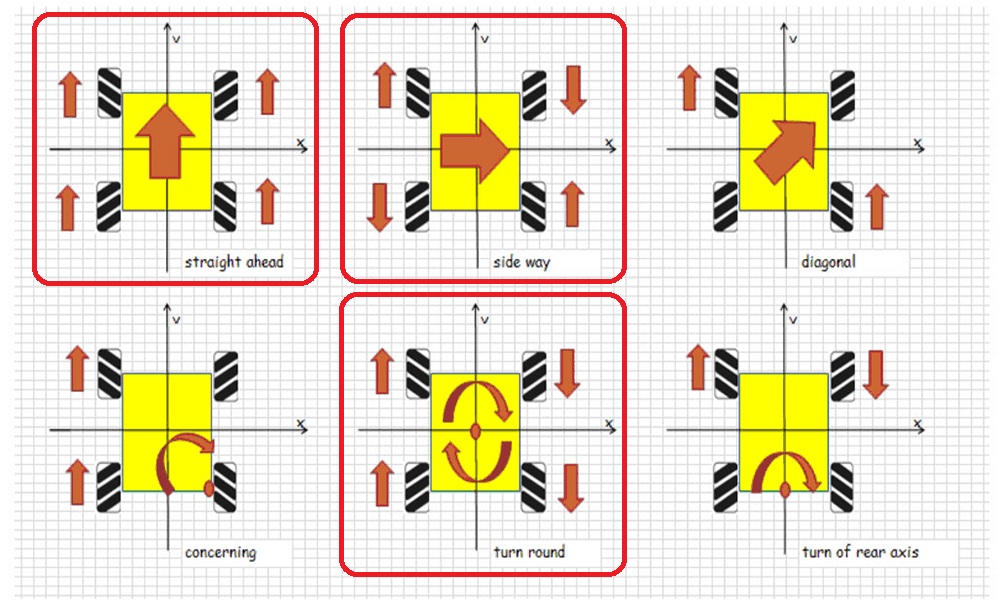

# OSOYOO 4WD Rover

## Rover ベース機体情報

* [OSOYOO 産業研究開発用 ロボットカー：Amazon](https://www.amazon.co.jp/Arduino%E9%81%A9%E7%94%A8-%E3%82%B9%E3%83%9E%E3%83%BC%E3%83%88%E3%83%AD%E3%83%9C%E3%83%83%E3%83%88-360%C2%B0%E5%85%A8%E6%96%B9%E5%90%91%E7%A7%BB%E5%8B%95-directional-Arduino%E7%94%A8%E9%9B%BB%E5%AD%90%E9%83%A8%E5%93%81%E3%82%AD%E3%83%83%E3%83%88/dp/B082D5HPZD/ref=sr_1_41?keywords=arduino%2B%E3%83%AD%E3%83%9C%E3%83%83%E3%83%88&qid=1670310474&sr=8-41&th=1)
* [osoyoo manual：V1.3 metal-mecanum](https://osoyoo.com/manual/V1.3metal-mecanum.pdf)
* [omni-direction-mecanum-wheel-robotic-kit-v1](https://osoyoo.com/ja/2019/11/08/omni-direction-mecanum-wheel-robotic-kit-v1/)

### モーター動作

赤枠の動作を、「エレベーター」、「エルロン」、「ラダー」で操作する。

## プロポ（RC）制御

* モーター動作の対応は、Lua スクリプトで実装する。

### Lua スクリプト

* [robotcar-motor-driver.lua](./text/robotcar-motor-driver.lua) 
　⇒　**モーター個々に性能差があるため、ローバーが直進しません。**

### ホイールエンコーダ

* [Wheel Encoders](https://ardupilot.org/rover/docs/wheel-encoder.html) 
　⇒　モーター性能差の対策を検討中。

## プログラム制御

* MAVROS から Python のプログラムで制御する。 
　⇒　**モーター動作の対応を Lua スクリプトで実装可能かが不明です。**
