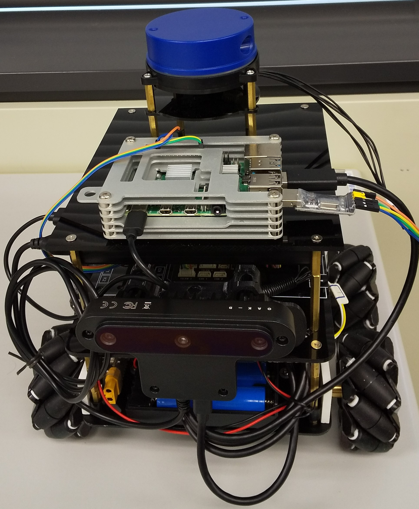
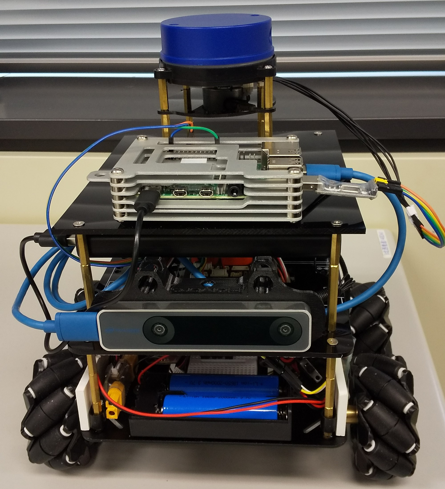

# OSOYOO 4WD Rover

## Rover ベース機体情報

* [OSOYOO 産業研究開発用 ロボットカー：Amazon](https://www.amazon.co.jp/Arduino%E9%81%A9%E7%94%A8-%E3%82%B9%E3%83%9E%E3%83%BC%E3%83%88%E3%83%AD%E3%83%9C%E3%83%83%E3%83%88-360%C2%B0%E5%85%A8%E6%96%B9%E5%90%91%E7%A7%BB%E5%8B%95-directional-Arduino%E7%94%A8%E9%9B%BB%E5%AD%90%E9%83%A8%E5%93%81%E3%82%AD%E3%83%83%E3%83%88/dp/B082D5HPZD/ref=sr_1_41?keywords=arduino%2B%E3%83%AD%E3%83%9C%E3%83%83%E3%83%88&qid=1670310474&sr=8-41&th=1)
* [osoyoo manual：V1.3 metal-mecanum](https://osoyoo.com/manual/V1.3metal-mecanum.pdf)
* [omni-direction-mecanum-wheel-robotic-kit-v1](https://osoyoo.com/ja/2019/11/08/omni-direction-mecanum-wheel-robotic-kit-v1/)

### モータードライバ（ESC）

付属の OSOYOO Model-X Motor Driver Module の扱いが難しいので、ESC に変更しました。
* 付属モータードライバ：[OSOYOO Model-X Motor Driver Module](https://osoyoo.com/2017/08/15/osoyoo-model-x-motor-driver-module/) を参考。
* 使用ESC：[RCクローラーカーボート20Aブラシなし電子トローラーESCブレーキなし](https://www.amazon.co.jp/shamjina-shama-4%E5%80%8B-%E5%80%8B20A%E3%83%96%E3%83%A9%E3%82%B7ESC%E3%81%AB%E3%81%AA%E3%81%97RC%E3%82%AF%E3%83%AD%E3%83%BC%E3%83%A9%E3%83%BC%E3%83%88%E3%83%A9%E3%83%83%E3%82%AF%E3%82%BF%E3%83%B3%E3%82%AF%E3%82%AB%E3%83%BC%E3%83%A2%E3%83%87%E3%83%AB%E3%82%A2%E3%82%AF%E3%82%BB%E3%82%B5%E3%83%AA%E3%83%BC3-9-4V/dp/B08NPFMJRX/ref=sr_1_3?__mk_ja_JP=%E3%82%AB%E3%82%BF%E3%82%AB%E3%83%8A&keywords=%E3%83%96%E3%83%A9%E3%82%B7%E3%81%AA%E3%81%97ESC%E3%81%AB%E9%81%A9%E7%94%A8RC%E3%82%AF%E3%83%AD%E3%83%BC%E3%83%A9%E3%83%BC%E3%82%BF%E3%83%B3%E3%82%AF%E3%82%AB%E3%83%BC%E3%83%91%E3%83%BC%E3%83%846%E5%80%8B%E3%82%BB%E3%83%83%E3%83%88&qid=1670980792&sr=8-3) を参考。

### モーター動作


赤枠の動作を、「エレベーター」、「エルロン」、「ラダー」で操作します。

## プロポ（RC）制御

* モーター動作の対応は、Lua スクリプトで実装します。

### Lua スクリプト

* [robotcar-motor-driver.lua](./text/robotcar-motor-driver.lua)<br>
　⇒　<font color="red">**モーター個々に性能差があるため、ローバーが直進しません。**</font>

channel_overrides.py を使って確認したところ、以下の結果がでました。
```
====================================
Read channels individually:
Ch1: 1499
Ch2: 1499
Ch3: 899
Ch4: 1499
```
不良交換したモーターの性能が明らかに他と異なることが分かりました。<br>
性能差が大きいので「Servo Output」で調整するのは難しいと考え、<br>
上記数値を参考に、Luaスクリプト内にモーター毎の調整を作りこみました。<br>
結果、プロポからのコントロールでは、ある程度安定して直進する様になりました。

### ホイールエンコーダ

* [Wheel Encoders](https://ardupilot.org/rover/docs/wheel-encoder.html)<br>
　⇒　モーター性能差の対策を検討中。

## プログラム制御

* MAVROS から Python のプログラムで制御します。<br>
　⇒　<font color="red">**モーター動作の対応を Lua スクリプトで実装可能かが不明です。**</font><br>
　　⇒　<font color="red">**ドローン開発が目標なので、以降はドローンで確認します。**</font>

* トリム調整で微調整を行います。<br>
  * [Save Steering Trim](https://ardupilot.org/rover/docs/savetrim.html?fbclid=IwAR3qOBSQVFbdIVd6RYl0MzHbB2qSnNWS1-IkTz9HKQGJxI4PMMl6r1D3ZUY) を参考。

## Rover外観

### OAK-Dカメラ搭載



### RealSense T265カメラ搭載


