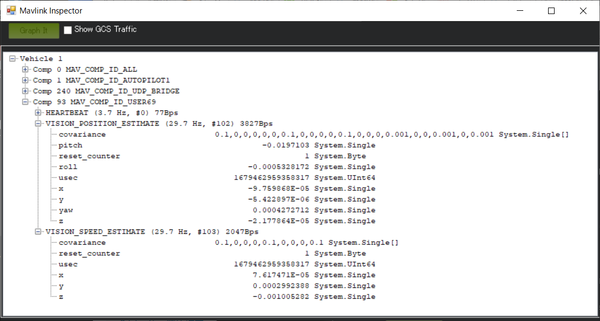
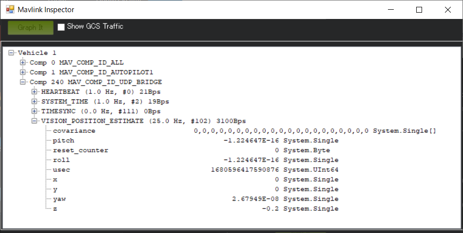

# APSync T265 ubuntu20.04 環境構築

## イメージファイルで環境構築

① 既存の APSync イメージをインストール

* [firmware.ardupilot.org](https://firmware.ardupilot.org/Companion/apsync/) より、"apsync-rpi-ubuntu-t265-latest.img.xz" をダウンロードし、<br>
  最近購入した Raspberry Pi 4 Model B (4GB) を使用して起動を試みてみましたが、<br>
  **<font color="red">ハードに対してファームウェアが古いため起動できませんでした。</font>**

  

## ubuntu20.04 をインストールして環境構築

### ① ubuntu20.04 インストール

[Rasberry Pi 4 Model BにUbuntu Server 22.04 LTSを導入](https://www.kabukigoya.com/2022/05/rasberry-pi-4-model-bubuntu-server-2204.html) を参考に、<br>
Ubuntu Server 20.04.5 LTS (64-bit) をインストールします。


* インストール後に設定するよりも簡単に設定できるので、<br>
  インストール時に以下の設定をお勧めします。

  * SSHの有効化
  * ユーザ名とパスワードの設定
  * Wi-Fiの設定
  * ロケールの設定

  


### ② IPアドレスの確認

インストール後にログインし、以下を参考にIPアドレスを確認します。

```
$ ip a
```

### ③ パッケージの更新

以下を参考にパッケージを更新します。

```
$ sudo apt update && sudo apt upgrade -y
```

### ④ GUI 環境の構築 

以下を参考に GUI（Lubuntu）をインストールします。

```
$ mkdir ~/GitHub
$ cd ~/GitHub
$ git clone https://github.com/wimpysworld/desktopify.git
$ cd desktopify/
$ sudo ./desktopify --de lubuntu
$ sudo reboot
```
* ターミナルに xterm が選択され、ターミナルが開かなくなった場合は、<br>
Edit->Preferences->Advanced->Terminal emulator: qterminal を選択します。

### ⑤ リモートデスクトップサーバ環境の構築

[Ubuntu20.04にXrdpをインストールする方法](https://ja.linux-console.net/?p=671#gsc.tab=0) を参考に環境を構築します。

```
$ sudo apt install -y xrdp
$ sudo adduser xrdp ssl-cert
$ sudo systemctl enable xrdp
$ sudo systemctl start xrdp
$ sudo reboot
```

* **<font color="red">realsense-viewer や rviz の様な画像を表示するソフトは画像が崩れるが、</font>**　<br>
ターミナルを使用するのであれば問題なく使用できる。

### ⑥ UART 設定変更

Ubuntu 20.04の UART0(/dev/serial0) は、デフォルトでシリアルコンソールに割り当てられているので<br>
**<font color="red">そのままの設定で UART0 を使用すると、OS が起動しなくなります。</font>**
* GUIをインストールしていると、メッセージも出さないまま起動しません。
* 下記はGUIをインストールしていない環境での起動画面の例です。

  

[Raspberry Pi 4 + Ubuntu 20.04で複数のUARTを有効にする](https://tshell.hatenablog.com/entry/2021/03/04/205346) と、
[The config.txt file](https://www.raspberrypi.com/documentation/computers/config_txt.html) を参考に、<br>
UART2（/dev/ttyAMA1）を有効にします。

[カメラの有効化 ── Ubuntu の場合](http://m-ac.jp/raspi/hardware/camera/enable_camera/ubuntu/index_j.phtml) を参考に、
camera（/dev/video0）を有効にします。

```
$ cd /boot/firmware/

$ sudo cp -pi config.txt config.bak

$ sudo vi config.txt
$ diff config.txt config.bak
65,67d64
< dtoverlay=uart2
< #dtoverlay=disable-bt
< #arm_boost=1
69,70d65
< #start_x=1
< #gpu_mem=128

$ sudo adduser $USER dialout
$ sudo reboot
```

* [Raspberry PIのGPIO上シリアルとArduinoの通信](https://qiita.com/ryugyoku/items/bf5fd10512c84a55d030) を参考に、<br>
  UART0（/dev/serial0）を無効にしても起動しません（効果なし）。<br>
  ⇒　**<font color="red">UART0(8, 10pin) は使用不可とします。</font>**
* [MAVProxy (Raspiコンパニオンコンピューター接続・インストール)](https://playing-engineer.com/wordpress/2022/12/05/ardupilot-raspi%e3%82%b3%e3%83%b3%e3%83%91%e3%83%8b%e3%82%aa%e3%83%b3%e3%82%b3%e3%83%b3%e3%83%94%e3%83%a5%e3%83%bc%e3%82%bf%e3%83%bc2/) を参考に、<br>
  Bluetooth をオフにしても起動しません（効果なし）。<br>
  ⇒　設定はコメントに変更しました。
* /dev/video0 が作成されない　⇒　カメラ（T265）動作に無関係。<br>
  ⇒　設定はコメントに変更しました。

### ⑦ UART 接続
* raspberry pi 4 Tx：27pin、Rx：28pin と FCU Telem2 Rx、Tx を接続します。

  

## カメラ（T265）環境構築

[Ubuntu 20.04 on Raspberry PI 4 model BでRealsenseカメラ(D415)を動かしてみる](https://qiita.com/nv-h/items/3bd206bebf9303dd6624) を参考に、<br>
Realsense SDK をインストールします。

* [Build Configuration - Intel RealSense](https://dev.intelrealsense.com/docs/build-configuration) を参考に、<br>
「DFORCE_RSUSB_BACKEND」を使用する手順例を選択しました。	

### ① 依存パッケージのインストール

```
$ sudo apt update && sudo apt upgrade -y

$ sudo apt install git libssl-dev libusb-1.0-0-dev pkg-config libgtk-3-dev -y
$ sudo apt install libglfw3-dev libgl1-mesa-dev libglu1-mesa-dev -y
$ sudo apt install cmake -y
$ sudo apt install g++ -y
$ sudo apt install python3-dev -y
```

### ② Realsense SDKのダウンロード

```
$ cd ~/GitHub
$ git clone https://github.com/IntelRealSense/librealsense
$ cd librealsense
$ git checkout -b v2.53.1 refs/tags/v2.53.1
$ git branch
  master
* v2.53.1
```

* 執筆時点の最新版が「v2.53.1」になります。<br>
　⇒　動作するが、時間が経過するとカメラからの情報が切れてしまう。
* [T265 stops sending data](https://github.com/IntelRealSense/librealsense/issues/6362) を参考に、「v2.32.1」を選択。<br>
　⇒　realsense-viewer でカメラが動作しません。
* [Raspberry Pi 4でRealsense T265を使う](https://qiita.com/hiro-han/items/90faf29406e689243b4a) を参考に、「v2.42.0」を選択。<br>
　⇒　realsense-viewer でカメラが動作しません。

### ③ ビルド

```
$ mkdir build && cd build
$ cmake ../ \
-DFORCE_RSUSB_BACKEND=true \
-DCMAKE_BUILD_TYPE=release \
-DBUILD_EXAMPLES=true \
-DBUILD_GRAPHICAL_EXAMPLES=true \
-DBUILD_PYTHON_BINDINGS=true \
-DPYTHON_EXECUTABLE=$(which python3)

$ sudo make uninstall && make clean && make && sudo make install
```

### ④ realsense-viewer用設定

```
$ sudo cp ~/.99-realsense-libusb.rules /etc/udev/rules.d/99-realsense-libusb.rules && sudo udevadm control --reload-rules && udevadm trigger

$ sudo reboot
```

### ⑤ Viwerの実行

Rasberry Pi の GUI 上のターミナルから、T265 の動作確認をします。

```
$ realsense-viewer
```

**<font color="red">※ 下記のエラーが発生しますが、</font>**

```
$ realsense-viewer
 10/03 15:11:05,957 INFO [281473265874000] (tm-boot.h:22) Found a T265 to boot
 10/03 15:11:06,971 WARNING [281473265874000] (messenger-libusb.cpp:65) bulk_transfer returned error, endpoint: 0x1, error: Resource temporarily unavailable, err. num: 11
 10/03 15:11:06,972 ERROR [281473265874000] (tm-boot.h:39) Error booting T265
 10/03 15:11:09,770 INFO [281473265874000] (synthetic-stream-gl.cpp:80) Initializing rendering, GLSL=0
 10/03 15:11:09,770 INFO [281473265874000] (synthetic-stream-gl.cpp:89)  0 GPU objects initialized
 10/03 15:11:09,904 INFO [281473265874000] (tm-boot.h:22) Found a T265 to boot
 10/03 15:11:10,918 WARNING [281473265874000] (messenger-libusb.cpp:65) bulk_transfer returned error, endpoint: 0x1, error: Resource temporarily unavailable, err. num: 11
 10/03 15:11:10,918 ERROR [281473265874000] (tm-boot.h:39) Error booting T265
```

**<font color="red">　USB を刺し直しすと解決します。</font>**


## pyrealsense2 環境構築

### ① pyrealsense2 環境設定

```
$ echo "PYTHONPATH=$PYTHONPATH:/usr/local/lib:/usr/lib/python3/dist-packages/pyrealsense2" >> ~/.bashrc
$ source ~/.bashrc
```

### ② 依存パッケージのインストール

```
$ sudo apt install python3-numpy -y
$ sudo apt install python3-opencv -y
$ sudo apt install python3-pip -y
```

### ③ サンプルプログラムの動作確認

Rasberry Pi の GUI 上のターミナルから、T265 の動作確認をします。

```
$ cd ~/GitHub/librealsense/wrappers/python/examples/
$ python3 t265_example.py

Frame #0
Position: x: 0, y: 0, z: 0
Velocity: x: 0, y: 0, z: 0
Acceleration: x: 0, y: 0, z: 0

　　　　　　　　：

Frame #49
Position: x: -2.32191e-05, y: -3.03128e-05, z: -0.000144963
Velocity: x: -0.000845491, y: 0.00475642, z: 0.00195427
Acceleration: x: -0.00256478, y: 0.0904832, z: 0.0510505
```

## RealSense ROS 環境構築

## ROS Noeticのインストール

[ubuntu20.04LTSにROS Noeticをインストールする](https://qiita.com/porizou1/items/7c2c4b33126cfad05944) を参考に、ROS Noetic をインストールします。

### ① source.list の設定

```
$ sudo sh -c 'echo "deb http://packages.ros.org/ros/ubuntu $(lsb_release -sc) main" > /etc/apt/sources.list.d/ros-latest.list'
```

### ② キーの設定 
```
$ sudo apt install curl
$ curl -s https://raw.githubusercontent.com/ros/rosdistro/master/ros.asc | sudo apt-key add -
```

### ③ インストール

```
$ sudo apt update
$ sudo apt install ros-noetic-desktop -y

$ sudo apt install python3-catkin-tools -y
$ sudo apt-get install ros-noetic-imu-tools -y
```

### ④ 環境設定

```
$ echo "source /opt/ros/noetic/setup.bash" >> ~/.bashrc
$ source ~/.bashrc

$ sudo apt install python3-rosdep python3-rosinstall python3-rosinstall-generator python3-wstool build-essential -y

$ sudo rosdep init
$ rosdep update
```

### ⑤ ワークスペースを作成

```
$ mkdir -p ~/catkin_ws/src
$ cd ~/catkin_ws/
$ catkin_make

$ echo "source ~/catkin_ws/devel/setup.bash" >> ~/.bashrc
$ source ~/.bashrc
```

## RealSense ROS のインストール

[ROS Wrapper for Intel RealSense Devices](https://github.com/IntelRealSense/realsense-ros/tree/ros1-legacy) を参考に、RealSense ROS をインストールします。

### ① 依存パッケージのインストール
```
$ sudo apt update && sudo apt upgrade -y
$ sudo apt install ros-noetic-ddynamic-reconfigure
```

### ② LibrealSense-ros のインストール

```
$ cd ~/catkin_ws/src/

$ git clone https://github.com/IntelRealSense/realsense-ros.git
$ cd realsense-ros/
$ git branch
* ros2-development

$ git checkout `git tag | sort -V | grep -P "^2.\d+\.\d+" | tail -1`
$ git branch
* (HEAD detached at 2.3.2)
  ros2-development

$ cd ../../
$ catkin_make clean
$ catkin_make -DCATKIN_ENABLE_TESTING=False -DCMAKE_BUILD_TYPE=Release
$ catkin_make install

$ source ~/.bashrc
```

### ③ 動作確認

[RealSense D435(距離計測カメラ) & T265(自己位置認識カメラ) をROS上で動かした](https://ogimotokin.hatenablog.com/entry/2019/06/05/222039) を参考に、<br>
Rasberry Pi の GUI 上のターミナルから、T265 の動作確認をします。

１つのターミナルで起動し、

```
$ roslaunch realsense2_camera rs_t265.launch
```

別のターミナルで、自己位置（相対位置）を表示します。

```
$ rostopic echo /tf

transforms:
  -
    header:
      seq: 0
      stamp:
        secs: 1678684106
        nsecs: 349720001
      frame_id: "camera_odom_frame"
    child_frame_id: "camera_pose_frame"
    transform:
      translation:
        x: 2.5222741896868683e-05
        y: 8.745512786845211e-06
        z: -0.0002126105537172407
      rotation:
        x: -0.006261443253606558
        y: 0.011176524683833122
        z: -1.3685310477740131e-05
        w: 0.9999179840087891
---
transforms:
  -
    header:
      seq: 0
      stamp:
        secs: 1678684106
        nsecs: 354726791
      frame_id: "camera_odom_frame"
    child_frame_id: "camera_pose_frame"
    transform:
      translation:
        x: 2.263886017317418e-05
        y: 8.973940566647798e-06
        z: -0.0002068436297122389
      rotation:
        x: -0.006260068155825138
        y: 0.011174202896654606
        z: -1.6503043298143893e-05
        w: 0.9999179840087891
---
```

## ArduPilot 環境構築（non-ROS）

[Intel RealSense T265](https://ardupilot.org/rover/docs/common-vio-tracking-camera.html) を参考に、ArduPilot の環境を構築します。

### ① ArduPilot 設定

* SERIAL2_PROTOCOL = 2 (MAVLink2). Note this assumes the RPI4 is connected to AutoPilot “Telem2” port.
* SERIAL2_BAUD = 921 (921600 baud)
* SERIAL2_OPTIONS = 0 (the default)
* VISO_TYPE = 2 (IntelT265)

* EK3_SRC1_POSXY = 6 (ExternalNav)
* EK3_SRC1_VELXY = 6 (ExternalNav)
* EK3_SRC1_VELZ = 6 (ExternalNav)
* EK3_SRC1_YAW = 6 (ExternalNav)
* EK3_SRC1_POSZ = 1 (Baro which is safer because of the camera’s weakness to high vibrations)

* GPS_TYPE = 0 (disable the GPS)
* COMPASS_USE = 0, COMPASS_USE2 = 0, COMPASS_USE3 = 0 to disable all compasses

## APSync 関連ツールをビルドして環境構築

[Ubuntu Companion](https://github.com/ArduPilot/companion/tree/master/Common/Ubuntu?fbclid=IwAR1EwGJqlMZ6CaEvMsXXn0k0354d2JHQCN0C5cNrXctUxwXqDOKUeH67ZbU) を参考に、APSync 関連ツールをビルドします。

### ① パッケージ等のインストール

以下を参考にパッケージ等をインストールします。

```
$ cd ~/GitHub
$ git clone https://github.com/ArduPilot/companion.git

$ mkdir log
$ sudo ./companion/Common/Ubuntu/set-hostname |& tee log/set-hostname.log
$ sudo ./companion/Common/Ubuntu/install_packages.sh |& tee log/install_packages.log
$ sudo apt install libopencv-dev python3-opencv -y
$ sudo ./companion/Common/Ubuntu/install_niceties |& tee log/install_niceties.log
$ sudo ./companion/Common/Ubuntu/install_avahi |& tee log/install_avahi.log
```

* install_packages.sh 実行時に以下のエラーが発生しますが、別途インストールしているので問題ありません。

  ```
  E: Package 'python-pip' has no installation candidate
  E: Unable to locate package python-opencv
  ```

### ② mavlink-router のインストール

以下を参考に mavlink-router をインストールします。

```
$ sudo apt install git ninja-build pkg-config gcc g++ systemd -y
$ sudo apt install python3-pip -y
$ sudo pip3 install meson

$ cd ~/GitHub
$ git clone --recurse-submodules https://github.com/mavlink-router/mavlink-router.git
$ cd mavlink-router

$ meson setup build .
$ ninja -C build
$ sudo ninja -C build install

$ cp -p ~/GitHub/companion/Common/Ubuntu/mavlink-router/mavlink-router.conf main.conf
$ vi main.conf

$ diff main.conf ~/GitHub/companion/Common/Ubuntu/mavlink-router/mavlink-router.conf
98d97
< #TcpServerPort = 5760
100d98
< Log=/var/log/flight-stack
107c105
< Device = /dev/ttyAMA1
---
> Device = /dev/ttyUSB0
110c108
< [UdpEndpoint to_t265]
---
> [UdpEndpoint to_mavproxy]
115,118c113,116
< #[UdpEndpoint to_dflogger]
< #Mode = Eavesdropping
< #Address = 127.0.0.1
< #Port = 14556
---
> [UdpEndpoint to_dflogger]
> Mode = Eavesdropping
> Address = 127.0.0.1
> Port = 14556
123c121
< Port = 14756
---
> Port = 14755
125c123
< [UdpEndpoint to_python]
---
> [UdpEndpoint to_openkai]
130,134c128,132
< #[UdpEndpoint to_14550]
< #Mode = Normal
< #Address = 10.0.1.255
< #Port = 14550
< #PortLock = 0
---
> [UdpEndpoint to_14550]
> Mode = Normal
> Address = 10.0.1.255
> Port = 14550
> PortLock = 0

$ sudo mkdir -p /etc/mavlink-router
$ sudo cp -p main.conf /etc/mavlink-router

$ sudo systemctl enable mavlink-router.service
$ sudo systemctl start mavlink-router.service

$ sudo reboot
```

以下を参考に mavlink-router のLOGファイルが生成されていることを確認をします。
* LOGファイル名は、XXXXX-date-time.bin、XXXXX は通番です。

```
$ ls /var/log/flight-stack
00000-2023-03-14_09-33-03.bin
```

### ③ apweb のインストール

以下を参考に apweb をインストールします。

```
$ cd ~/GitHub
$ sudo apt install python3-pip libtalloc-dev -y
$ sudo apt install make
$ sudo apt update
$ sudo apt install python2 -y
$ sudo apt install curl
$ curl https://bootstrap.pypa.io/pip/2.7/get-pip.py --output get-pip.py
$ sudo python2 get-pip.py
$ pip2 install future --user
$ sudo ln -s /usr/bin/python2 /usr/bin/python

$ git clone -b video_streaming https://github.com/shortstheory/APWeb.git
$ cd APWeb/modules
$ rmdir mavlink/
$ git clone --recurse-submodules https://github.com/ArduPilot/mavlink.git
$ cd ../
$ make CFLAGS=-Wno-error
$ sudo rm /usr/bin/python

$ APWEB_HOME=~/start_apweb
$ mkdir $APWEB_HOME
$ cp web_server $APWEB_HOME
$ cd $APWEB_HOME
$ vi APWeb.service
　※記述内容は下記を参照して下さい。
$ sudo cp -p APWeb.service /etc/systemd/system/APWeb.service
$ sudo systemctl enable APWeb.service
$ sudo systemctl start APWeb.service
$ sudo reboot
```
* APWeb.service
```
[Unit]
Description=ApWeb Service

[Service]
Type=simple
ExecStart=/home/pi/start_apweb/web_server -p 80 -f 14756
WorkingDirectory=/home/pi/start_apweb
Restart=on-failure
User=root

[Install]
WantedBy=multi-user.target
```

* APWeb/modules/mavlink が --recurse-submodules で clone されないため、<br>
  **<font color="red">mavlink を APWeb/modules の下にマニュアルで clone します。</font>**

  ```
  エラーメッセージ：
  　Submodule 'modules/mavlink' (git://github.com/ArduPilot/mavlink) registered for path 'modules/mavlink'
  　Cloning into '/home/pi/APWeb/modules/mavlink'...
  　fatal: unable to connect to github.com:
  　github.com[0: 20.27.177.113]: errno=Connection timed out
  
  　fatal: clone of 'git://github.com/ArduPilot/mavlink' into submodule path '/home/pi/APWeb/modules/mavlink' failed
  　Failed to clone 'modules/mavlink'. Retry scheduled
  対策方法：
    https://github.com/ArduPilot/mavlink.git を APWeb/modules の下にマニュアルで clone します。
  対象ファイル：
  　mavlink
  ```

Rasberry Pi の Webブラウザで ”http://127.0.0.1” にアクセスして動作確認をします。


### ④ pymavlink のインストール

以下を参考に pymavlink をインストールします。

* mavlink の最新版をダウンロードします。

```
$ cd ~/GitHub
# Dependencies
$ sudo apt install python3-pip -y
$ sudo apt install python3-lxml libxml2-utils -y

# Clone mavlink into the directory of your choice
$ git clone --recurse-submodules https://github.com/ArduPilot/mavlink.git
$ cd mavlink

# Set the PYTHONPATH environment variable to the path of the root of the cloned mavlink repository
$ PYTHONPATH=$PWD
```

* pymavlink をビルドいます。

```
$ cd ~/GitHub
$ sudo pip3 uninstall pymavlink
$ \rm -rf pymavlink

$ git clone https://github.com/ArduPilot/pymavlink
$ cd pymavlink
$ sudo MDEF=/home/pi/GitHub/mavlink/message_definitions python3 -m pip install . -v
```

### ⑤ wifi_access_point のインストール

以下を参考に NetworkManager をインストールします。

```
$ cd ~/
$ sudo rm /etc/network/interfaces
$ sudo touch /etc/network/interfaces
$ sudo apt-get install -y network-manager

$ sudo systemctl disable networking
$ sudo systemctl stop networking

$ sudo apt-get remove -y modemmanager
$ sudo mv /etc/wpa_supplicant/wpa_supplicant.conf{,-unused}

$ sudo systemctl stop wpa_supplicant
$ sudo systemctl disable wpa_supplicant
$ sudo killall /usr/sbin/wpa_supplicant || true

$ sudo systemctl start NetworkManager
$ sudo systemctl enable NetworkManager
$ sudo reboot
```

* 起動中の環境によって、コマンドが失敗することがあるため、個々に確認が必要です。

以下を参考に wifi_access_point をインストールします。

```
$ cd ~/GitHub
$ sudo ./companion/Common/Ubuntu/3_wifi_access_point.sh |& tee log/3_wifi_access_point.log
$ sudo reboot
```

Rasberry Pi のアクセスポイント "ardupilot" にアクセスして動作確認をします。

### ⑥ MAVProxy のインストール

以下を参考に MAVProxy をインストールします。

```
$ sudo apt-get install python3-dev python3-opencv python3-wxgtk4.0 python3-pip python3-matplotlib python3-lxml python3-pygame -y
$ pip3 install PyYAML mavproxy --user

$ cat >>$HOME/.mavinit.scr <<EOF2
set moddebug 3
EOF2

$ sudo reboot
```

以下を参考に MAVProxy の起動を確認をします。

```
$ mavproxy.py --master=127.0.0.1:14655 --baudrate 921600 --aircraft MyRover
Connect 127.0.0.1:14655 source_system=255
Running script (/home/pi/.mavinit.scr)
Running script /home/pi/.mavinit.scr
-> set moddebug 3
no script MyRover/mavinit.scr
Log Directory: MyRover/logs/2023-03-20/flight3
Telemetry log: MyRover/logs/2023-03-20/flight3/flight.tlog
Waiting for heartbeat from /dev/ttyAMA1
MAV> Detected vehicle 1:1 on link 0
online system 1
HOLD> Mode HOLD
fence present
Detected vehicle 1:0 on link 0
AP: ArduRover V4.2.3 (2172cfb3)
AP: ChibiOS: 38022f4f
AP: CubeOrangePlu 0043002D 31395105 3539333
AP: RCOut: PWM:1-14
AP: IMU0: fast sampling enabled 2.0kHz
AP: IMU1: fast sampling enabled 9.0kHz/2.3kHz
AP: IMU2: fast sampling enabled 9.0kHz/2.3kHz
Received 855 parameters (ftp)
Saved 855 parameters to MyRover/logs/2023-03-20/flight3/mav.parm

HOLD> param show ARMING_CHECK
HOLD> ARMING_CHECK     1

HOLD> param set ARMING_CHECK 0
HOLD>
HOLD> arm throttle
HOLD> Got COMMAND_ACK: COMPONENT_ARM_DISARM: ACCEPTED
AP: Warning: Arming Checks Disabled
AP: Throttle armed
ARMED
Arming checks disabled

HOLD> mode GUIDED
HOLD> Got COMMAND_ACK: DO_SET_MODE: ACCEPTED
GUIDED> Mode GUIDED

GUIDED> AP: EKF3 IMU0 forced reset
AP: EKF3 IMU0 initialised

GUIDED> AP: EKF3 IMU0 tilt alignment complete

GUIDED>
```

* 下記は、mavlink-router でポートを分岐させる場合の例です。
  ```
  $ mavproxy.py --master=/dev/ttyAMA1 --out=127.0.0.1:14655 --out=127.0.0.1:14756 --out=127.0.0.1:14765 --baudrate 921600 --aircraft MyRover
  ```

### ⑦ Python packages インストール

```
# pip install may require sudo, so proceed accordingly
$ pip3 install transformations
$ pip3 install apscheduler

# Install serial packages for serial connection
$ sudo pip3 install pyserial
```

### ⑧ dronekit インストール

```
$ cd ~/GitHub
$ pip3 uninstall dronekit
$ \rm -rf dronekit-python/

$ git clone https://github.com/dronekit/dronekit-python
$ cd dronekit-python
$ sudo pip3 install .
```

* dronekit は、mavlink-router で分岐したポートに接続すると、エラーが発生するため、<br>
  **<font color="red">分岐ポートに接続する場合は使用禁止、pymavlink のみでコーディング。</font>**

  ```
  エラーメッセージ：
    ERROR:dronekit:Exception in message handler for HEARTBEAT
    Traceback (most recent call last):
      File "/home/pi/.local/lib/python3.8/site-packages/dronekit/__init__.py", line 1531, in notify_message_listeners
      fn(self, name, msg)
      File "/home/pi/.local/lib/python3.8/site-packages/dronekit/__init__.py", line 1223, in listener
      raise APIException("mode (%s, %s) not available on mavlink definition" % (m.custom_mode, m.base_mode))
    dronekit.APIException: mode (0, 0) not available on mavlink definition
  　　　　　　　　：
  対策方法：
    対策困難なため、pymavlink のみでコーディングします。
  対象ファイル：
  　dronekit-python
  ```
  
  詳しくは、[
Error sending dronekit command while navigating in t265](https://discuss.ardupilot.org/t/error-sending-dronekit-command-while-navigating-in-t265/71170/3?fbclid=IwAR0NiZw9WUuyz4FeKnKGqHQ5aVfyLp5T6_JciGuxKLronhrFxlyLhcR8VZ4) 参照。

### ⑨ uhubctl インストール

```
$ sudo apt install -y libusb-1.0-0-dev

$ cd ~/GitHub
$ git clone https://github.com/mvp/uhubctl
$ cd uhubctl
$ make

$ UHUBCTL_HOME="$HOME/start_uhubctl"
$ mkdir $UHUBCTL_HOME
$ cp -p uhubctl $UHUBCTL_HOME
$ cd $UHUBCTL_HOME
$ cp -p ~/GitHub/companion/Common/Ubuntu/uhubctl/*start*.sh .

$ cp -p start_uhubctl.sh start_uhubctl.sh.bak
$ vi start_uhubctl.sh
$ diff start_uhubctl.sh start_uhubctl.sh.bak
6c6
< cd ~pi/start_uhubctl
---
> pushd ~apsync/start_uhubctl

$ cp -p autostart_uhubctl.sh autostart_uhubctl.sh.bak
$ vi autostart_uhubctl.sh
$ diff autostart_uhubctl.sh autostart_uhubctl.sh.bak
7c7
< UHUBCTL_HOME=~pi/start_uhubctl
---
> UHUBCTL_HOME=~apsync/start_uhubctl

$ sudo sh autostart_uhubctl.sh
```

以下を参考に USB の接続を確認をします。

```
$ sudo ./uhubctl
Current status for hub 3 [1d6b:0002 Linux 5.4.0-1081-raspi dwc2_hsotg DWC OTG Controller fe980000.usb, USB 2.00, 1 ports, ppps]
  Port 1: 0000 off
Current status for hub 2 [1d6b:0003 Linux 5.4.0-1081-raspi xhci-hcd xHCI Host Controller 0000:01:00.0, USB 3.00, 4 ports, ppps]
  Port 1: 02a0 power 5gbps Rx.Detect
  Port 2: 0203 power 5gbps U0 enable connect [8087:0b37 Intel(R) Corporation Intel(R) RealSense(TM) Tracking Camera T265 944222110910]
  Port 3: 02a0 power 5gbps Rx.Detect
  Port 4: 02a0 power 5gbps Rx.Detect
Current status for hub 1-1 [2109:3431 USB2.0 Hub, USB 2.10, 4 ports, ppps]
  Port 1: 0100 power
  Port 2: 0100 power
  Port 3: 0303 power lowspeed enable connect [03f0:334a Chicony HP Business Slim Keyboard]
  Port 4: 0303 power lowspeed enable connect [093a:2510 PixArt USB Optical Mouse]
Current status for hub 1 [1d6b:0002 Linux 5.4.0-1081-raspi xhci-hcd xHCI Host Controller 0000:01:00.0, USB 2.00, 1 ports, ppps]
  Port 1: 0503 power highspeed enable connect [2109:3431 USB2.0 Hub, USB 2.10, 4 ports, ppps]
```

## ArduPilot 動作確認（non-ROS）

[Intel RealSense T265](https://ardupilot.org/rover/docs/common-vio-tracking-camera.html) を参考に、ArduPilot の動作を確認します。

### ① mavlink 動作確認

```
$ cd ~/catkin_ws/src
$ git clone https://github.com/hoangthien94/vision_to_mavros.git

$ cd ~/catkin_ws/src/vision_to_mavros/scripts
$ chmod +x t265_to_mavlink.py
$ cp -p t265_to_mavlink.py t265_to_mavlink.py.bak
$ vi t265_to_mavlink.py
$ diff t265_to_mavlink.py t265_to_mavlink.py.bak
48,49c48
< #connection_string_default = '/dev/ttyAMA1'
< connection_string_default = '127.0.0.1:14655'
---
> connection_string_default = '/dev/ttyUSB0'
51c50
< connection_timeout_sec_default = 3600
---
> connection_timeout_sec_default = 5
265c264
<         m = conn.recv_match(type=interesting_messages, timeout=None, blocking=True)
---
>         m = conn.recv_match(type=interesting_messages, timeout=1, blocking=True)

$ echo 'PATH=$PATH:~/catkin_ws/src/vision_to_mavros/scripts' >> ~/.bashrc
$ source ~/.bashrc
$ t265_to_mavlink.py
```

結果

```
INFO: Using default connection_string 127.0.0.1:14655
INFO: Using default connection_baudrate 921600
INFO: Using default vision_position_estimate_msg_hz 30.0
INFO: Using default vision_position_delta_msg_hz 30.0
INFO: Using default vision_speed_estimate_msg_hz 30.0
INFO: Using camera position offset: Disabled
INFO: Using compass: Disabled
INFO: Using default scale factor 1.0
INFO: Using default camera orientation 0
INFO: pyrealsense2 version: 2.53.1
INFO: Starting Vehicle communications
INFO: Connecting to camera...
INFO: Camera connected.
INFO: Received first ATTITUDE message with heading yaw 135.64 degrees
INFO: Sending vision messages to FCU
INFO: Tracking confidence: Medium
```

* フレームの取得でタイムアウトが発生する場合があります。

  ```
  エラーメッセージ：
    Frame didn't arrive within 5000
    Closing the script...
    INFO: Realsense pipeline and vehicle object closed.
  対策方法：
    connection_timeout_sec_default = 5 ⇒ 3600
    conn.recv_match() timeout=1 ⇒ None
    ※この修正でも、最長 45 分程度で、カメラからの情報が切れてしまう。
  対象ファイル：
  　t265_to_mavlink.py
  ```

### ② stream 動作確認

```
$ echo 'PYTHONPATH=$PYTHONPATH:/usr/local/lib' >> ~/.bashrc
$ source ~/.bashrc
$ python3 t265_test_streams.py
```

結果

```
Found device: Intel RealSense T265 , with serial number:  944222110910
Available streams:
['__class__',
 '__delattr__',
 '__dir__',
 '__doc__',
 '__entries',
 '__eq__',
 '__format__',
 '__ge__',
 '__getattribute__',
 '__getstate__',
 '__gt__',
 '__hash__',
 '__index__',
 '__init__',
 '__init_subclass__',
 '__int__',
 '__le__',
 '__lt__',
 '__members__',
 '__module__',
 '__ne__',
 '__new__',
 '__reduce__',
 '__reduce_ex__',
 '__repr__',
 '__setattr__',
 '__setstate__',
 '__sizeof__',
 '__str__',
 '__subclasshook__',
 'accel',
 'any',
 'color',
 'confidence',
 'depth',
 'fisheye',
 'gpio',
 'gyro',
 'infrared',
 'name',
 'pose',
 'value']
Left frame (800, 848)
Right frame (800, 848)

Frame number:     5
Position xyz: -0.0000  0.0001 -0.0000
Velocity xyz: -0.0003  0.0049 -0.0010
Accelera xyz:  0.0062  0.0703 -0.0018
Quatern xyzw: -0.0110 -0.0002  0.0045  0.9999
Left frame (800, 848)
Right frame (800, 848)

Frame number:     5
Position xyz: -0.0000  0.0001 -0.0000
Velocity xyz: -0.0003  0.0049 -0.0010
Accelera xyz:  0.0062  0.0703 -0.0018
Quatern xyzw: -0.0110 -0.0002  0.0045  0.9999
Left frame (800, 848)
Right frame (800, 848)

Frame number:    11
Position xyz: -0.0000  0.0002 -0.0006
Velocity xyz: -0.0005  0.0070 -0.0092
Accelera xyz:  0.0037  0.1002 -0.0461
Quatern xyzw: -0.0119 -0.0002  0.0046  0.9999
Left frame (800, 848)
Right frame (800, 848)

Frame number:    12
Position xyz: -0.0000  0.0002 -0.0006
Velocity xyz: -0.0005  0.0076 -0.0094
Accelera xyz:  0.0036  0.1065 -0.0450
Quatern xyzw: -0.0119 -0.0002  0.0046  0.9999
Left frame (800, 848)
Right frame (800, 848)
```

### ③ ArduPilot 動作確認

#### (1) Mission Planner を起動

#### (2) t265_to_mavlink.sh を起動

* t265_to_mavlink.sh

  ```
  #!/bin/bash
  
  while true
  do
      t265_to_mavlink.py
  done
  ```

#### (3) Mission Planner から以下を確認

* 距離情報の受信確認
  1. Mission Planner で Ctrl+F を押します。
  1. “Mavlink Inspector” をクリックします。
  1. VISION_POSITION_DELTA の値を確認します。
  

  * **<font color="red">t265_to_mavlink.py 単体では最長 45 分程度で、カメラからの情報が切れてしまう。</font>**<br>

## ROS インターフェース 環境構築

### ① MAVROS のインストール

[ROS講座131 ArdupilotとROS経由で接続する](https://qiita.com/srs/items/09d217c8b9f9e21d2f1d) を参考に、MAVROS をインストールします。

```
$ sudo apt install ros-noetic-mavros -y
$ sudo apt install ros-noetic-mavros-extras -y
```

### ② Vision_to_mavros のインストール

[ROS and VIO tracking camera for non-GPS Navigation](https://ardupilot.org/dev/docs/ros-vio-tracking-camera.html) を参考に、<br>
Vision_to_mavros をインストールします。

```
$ cd ~/catkin_ws/src
$ git clone https://github.com/hoangthien94/vision_to_mavros.git
$ cd ../
$ catkin_make

$ source ~/.bashrc
```

## ArduPilot 環境構築（ROS）

[ROS and VIO tracking camera for non-GPS Navigation](https://ardupilot.org/dev/docs/ros-vio-tracking-camera.html) を参考に、ArduPilot の環境を構築します。

### ① ArduPilot 設定

* SERIAL2_PROTOCOL = 2 (MAVLink2). Note this assumes the RPI4 is connected to AutoPilot “Telem2” port.
* SERIAL2_BAUD = 921 (921600 baud)
* SERIAL2_OPTIONS = 0 (the default)
* BRD_SER2_RTS = 2 (the default)
* BRD_RTC_Types = 2 (GPS -> UTC Time)
* VISO_TYPE = 2 (IntelT265)
* AHRS_EKF_TYPE = 3 (the default) to use EKF3
* EK2_ENABLE = 0 (the default)
* EK3_ENABLE = 1 (the default)

* EK3_SRC1_POSXY = 6 (ExternalNav)
* EK3_SRC1_VELXY = 6 (ExternalNav)
* EK3_SRC1_VELZ = 6 (ExternalNav)
* EK3_SRC1_YAW = 6 (ExternalNav)
* EK3_SRC1_POSZ = 1 (Baro which is safer because of the camera’s weakness to high vibrations)

* EK3_GPS_CHECK = 0 to bypass the EKF’s check of the GPS
* EK3_POSNE_M_NSE = 0.1
* EK3_VELD_M_NSE = 0.1
* EK3_VELNE_M_NSE = 0.1
* GPS_TYPE = 0 to disable the GPS
* COMPASS_ENABLE = 0, COMPASS_USE = 0, COMPASS_USE2 = 0, COMPASS_USE3 = 0 to disable the EKF’

### ② mavlink-router 停止

```
$ sudo systemctl stop mavlink-router.service
$ sudo systemctl disable mavlink-router.service
$ sudo reboot
```

* roslaunch mavros で timeout が発生するため、<br>
  **<font color="red">mavlink-router.service は停止し、必要に応じて起動します。</font>**

  ```
  エラーメッセージ：
  [ WARN] [1679283746.074020083]: GF: timeout, retries left 2
  [ WARN] [1679283746.076230024]: RP: timeout, retries left 2
  [ WARN] [1679283746.078598645]: WP: timeout, retries left 2
  　　　　　　　　：
  [ WARN] [1679283758.190133043]: PR: request param #0 timeout, retries left 2, and 426 params still missing
  [ WARN] [1679283759.689046020]: PR: request param #6 timeout, retries left 2, and 421 params still missing
  　　　　　　　　：
  対策方法：
    mavlink-router.service を停止する。
  対象ファイル：
  　mavlink-router
  ```

### ③ ROS 起動

Rasberry Pi で３つのターミナルを開き、ROSを起動します。

ターミナル１

```
$ roslaunch realsense2_camera rs_t265.launch
```

ターミナル２

```
$ roslaunch vision_to_mavros t265_tf_to_mavros.launch
```

ターミナル３

```
$ roslaunch mavros apm.launch fcu_protocol:=v2.0 fcu_url:=/dev/ttyAMA1:921600
```

別のターミナルで、自己位置検出結果を表示します。

```
$ rostopic echo /tf
transforms:
  -
    header:
      seq:0
      stamp:
        secs: 1680591625
        nsecs: 815077066
      frame_id: "camera_odom_frame"
    child_frame_id: "camera_pose_frame"                                       
    transform:
      translation:
        x: -0.0007328020874410868
        y: -3.408862176002003e-05
        z: -0.00018071342492476106
      rotation:
        x: -0.04234035313129425
        y: -0.998621940612793
        z: -0.022722050547599792
        w: 0.021103613078594208
---
　　　　：
```

* [RTT timesync issue after reboot](https://github.com/mavlink/mavros/issues/1339) を参考に、下記ワーニングを対策します。

  ```
  エラーメッセージ：
  　[ WARN] [xxxx]: TM : RTT too high for timesync: 17.76 ms.
  対策方法：
    下記手順で、timesync_rate を 0 に変更します。
    $ cd /opt/ros/noetic/share/mavros/launch/
    $ sudo cp -p apm_config.yaml apm_config.yaml.bak
    $ sudo vi apm_config.yaml
    $ diff apm_config.yaml apm_config.yaml.bak
    2,13c12,13
    <   timeout: 50.0          # heartbeat timeout in seconds
    <   timesync_rate: 0.0    # TIMESYNC rate in Hertz (feature disabled if 0.0)
    ---
    >   timeout: 10.0          # heartbeat timeout in seconds
    >   timesync_rate: 10.0    # TIMESYNC rate in Hertz (feature disabled if 0.0)
  対象ファイル：
  　apm_config.yaml
  ```

ターミナル４
* LOG取得用

```
$ rosrun rqt_console rqt_console
```

### ③ ArduPilot 動作確認

#### (1) Mission Planner を起動

#### (2) ROS を起動

#### (3) Mission Planner から以下を確認

* 距離情報の受信確認
  1. Mission Planner で Ctrl+F を押します。
  1. “Mavlink Inspector” をクリックします。
  1. VISION_POSITION_DELTA の値を確認します。

  
  
  * **<font color="red">最長 5 分程度で、カメラからの情報が切れてしまう。<br>　⇒　対応困難なため、カメラを Luxonis OAK-D に変更します。</font>**<br>

    以下は、その際の LOG の例です。（CSVは、rqt_console の出力）

      * [mavros_1.log](./image/mavros_1.log) 
      * [mavros_1.csv](./image/mavros_1.csv) 
      * [mavros_2.log](./image/mavros_2.log) 
      * [mavros_2.csv](./image/mavros_2.csv) 

## Luxonis OAK-D ROS 環境構築


* [OAK-D-Lite をROS Noeticで動かす](https://qiita.com/porizou1/items/b7c10f6e4d3e3cbca6e9) を参考。

### ① 依存パッケージのインストール

```
$ sudo wget -qO- https://raw.githubusercontent.com/luxonis/depthai-ros/main/install_dependencies.sh | sudo bash

$ sudo apt install python3-vcstool
$ sudo apt update && sudo apt upgrade -y
```

### ② ROSパッケージのインストール

```
$ cd ~/catkin_ws
$ wget https://raw.githubusercontent.com/luxonis/depthai-ros/main/underlay.repos
$ vi underlay.repos　⇒　下記の編集を実施
repositories:
  luxonis/depthai-ros:
    type: git
    url: https://github.com/luxonis/depthai-ros.git
    version: main
  luxonis/depthai-ros-examples:
    type: git
    url: https://github.com/luxonis/depthai-ros-examples.git
    version: main
　　　　↓
repositories:
  luxonis/depthai-ros:
    type: git
    url: https://github.com/luxonis/depthai-ros.git
    version: noetic

$ vcs import src < underlay.repos
$ rosdep install --from-paths src --ignore-src -r -y
$ source /opt/ros/noetic/setup.bash
$ catkin_make -j1

$ source ~/.bashrc
```

### ③ 動作確認

ターミナル１で起動し、

```
$ roslaunch depthai_examples yolov4_publisher.launch
```

ターミナル２で、物体検出結果を表示します。

```
$ rostopic echo /yolov4_publisher/color/yolov4_Spatial_detections

eader:
  seq: 52
  stamp:
    secs: 1680571500
    nsecs: 380544384
  frame_id: "oak_rgb_camera_optical_frame"
detections:
  -
    results:
      -
        id: 39
        score: 0.7699227333068848
    bbox:
      center:
        x: 185.0
        y: 263.0
        theta: 0.0
      size_x: 28.0
      size_y: 90.0
    position:
      x: -0.05504579469561577
      y: -0.1334160715341568
      z: 1.3082307577133179
    is_tracking: False
    tracking_id: ''
  -
　　　　：
```

別のターミナルで、自己位置検出結果を表示します。

```
$ rostopic echo /tf
表示なし
```

  * **<font color="red">自己位置（tf）を求めるROSプログラムが公開されていない。<br>　⇒　対応困難なため、自己位置は LiDAR（YDLiDAR X4）で求めることにします。</font>**<br>


## YDLiDAR X4 ROS 環境構築


### ① YDLidar-SDK のインストール

* [YDLidar-SDK/How to Build and Install](https://github.com/YDLIDAR/YDLidar-SDK/blob/master/doc/howto/how_to_build_and_install.md) を参考。

#### (1) 依存パッケージのインストール

```
$ sudo apt install cmake pkg-config
$ sudo apt-get install python swig
$ sudo apt-get install python3-pip
```

#### (2) ビルド

```
$ cd ~GitHub/
$ git clone https://github.com/YDLIDAR/YDLidar-SDK.git
$ mkdir -p YDLidar-SDK/build
$ cd YDLidar-SDK/build
$ cmake ..
$ make
$ sudo make install
```

#### (3) 動作確認

```
$ ./tri_test 
__   ______  _     ___ ____    _    ____  
\ \ / /  _ \| |   |_ _|  _ \  / \  |  _ \ 
 \ V /| | | | |    | || | | |/ _ \ | |_) | 
  | | | |_| | |___ | || |_| / ___ \|  _ <  
  |_| |____/|_____|___|____/_/   \_\_| \_\ 

[0] ydlidar /dev/ttyS0
[1] ydlidar1.1 /dev/ttyUSB0
Please select the lidar port:1
Baudrate:
[0] 115200
[1] 128000
[2] 150000
[3] 153600
[4] 230400
[5] 460800
[6] 512000
Please select the lidar baudrate:1
Whether the Lidar is one-way communication [yes/no]:no
Please enter the lidar scan frequency[5-12]:10
[YDLIDAR] SDK initializing
[YDLIDAR] SDK has been initialized
[YDLIDAR] SDK Version: 1.1.6
[YDLIDAR] Lidar successfully connected /dev/ttyUSB0[128000]
[YDLIDAR] Lidar running correctly! The health status: good
[YDLIDAR] Connection established in [/dev/ttyUSB0][128000]
Firmware version: 1.10
Hardware version: 1
Model: X4
Serial: 2022052500010032
[YDLIDAR] Lidar init success, Elapsed time 695 ms
[YDLIDAR] Start to getting intensity flag
[YDLIDAR] Auto set intensity 0
[YDLIDAR] End to getting intensity flag
[YDLIDAR] Create thread 0xAE0301C0
[YDLIDAR] Successed to start scan mode, Elapsed time 1125 ms
[YDLIDAR] Fixed Size: 505
[YDLIDAR] Sample Rate: 5.00K
[YDLIDAR] Successed to check the lidar, Elapsed time 0 ms
[YDLIDAR] Current Sampling Rate : 5.00K
[YDLIDAR] Now lidar is scanning...
User version 0.0
Scan received [505] points inc [0.012467]
Scan received [505] points inc [0.012467]
Scan received [505] points inc [0.012467]
Scan received [505] points inc [0.012467]
Scan received [505] points inc [0.012467]
Scan received [505] points inc [0.012467]
```

### ② YDLidar_ros_driver のインストール

* [YDLIDAR ROS Driver](https://github.com/YDLIDAR/ydlidar_ros_driver) を参考。

#### (1) ビルド

```
$ cd ~/catkin_ws/src
$ git clone https://github.com/YDLIDAR/ydlidar_ros_driver.git
$ cd ../
$ catkin_make -j1

$ source ~/.bashrc
```

#### (2) udevに追加(/dev/ydlidar を使えるようにする)

```
$ cd ~/catkin_ws
$ chmod 0777 src/ydlidar_ros_driver/startup/*
$ sudo sh src/ydlidar_ros_driver/startup/initenv.sh

$ sudo ln -s /dev/ttyUSB0 /dev/ydlidar
```

#### (3) 動作確認

ターミナル１で起動し、

```
$ roslaunch ydlidar_ros_driver X4.launch
```

別のターミナルで、自己位置検出結果を表示します。

```
$ rostopic list
/point_cloud
/rosout
/rosout_agg
/scan
/tf

$ rostopic echo /tf
transforms:
  -
    header:
      seq:0
      stamp:
        secs: 1680591190
        nsecs: 745079458
      frame_id: "/base_footprint"
    child_frame_id: "/laser_frame"
    transform: 
      translation: 
        x: 0.0
        y: 0.0
        z: 0.2
      rotation: 
        x: 0.0
        y: 0.0
        z: 0.0
        w: 1.0
---
　　　　：
```

ターミナル２で、vision_to_mavros を実行します。

```
$ roslaunch vision_to_mavros t265_tf_to_mavros.launch target_frame_id:=/base_footprint source_frame_id:=laser_frame
```

* t265_tf_to_mavros.launch より抜粋

  ```
  <arg name="target_frame_id"   default="/camera_odom_frame" />
  <arg name="source_frame_id"   default="/camera_link" />
  ```

* X4.launch より抜粋

  ```
  <node pkg="tf" type="static_transform_publisher" name="base_link_to_laser4"
    args="0.0 0.0 0.2 0.0 0.0 0.0 /base_footprint /laser_frame 40" />
  ```

ターミナル３で、mavros を実行します。

```
$ roslaunch mavros apm.launch fcu_protocol:=v2.0 fcu_url:=/dev/ttyAMA1:921600
```

### ③ ArduPilot 動作確認

#### (1) Mission Planner を起動

#### (2) ROS を起動

#### (3) Mission Planner から以下を確認

* 距離情報の受信確認
  1. Mission Planner で Ctrl+F を押します。
  1. “Mavlink Inspector” をクリックします。
  1. VISION_POSITION_DELTA の値を確認します。

  
  
  * **動作問題なし。**

#### (4) ROS 動作確認

別のターミナルで、以下を実行します。

```
$ rosrun mavros mavsys mode -c GUIDED
Mode changed.
$ rosrun mavros mavsafety arm
```

mavros のターミナルで以下を確認します。

```
[ INFO] [1680658308.333477395]: FCU: Throttle armed
```

## Hector SRAM 環境構築

[ROS and Hector SLAM for Non-GPS Navigation](https://ardupilot.org/dev/docs/ros-slam.html) を参考。

### ① 依存パッケージのインストール

```
$ sudo apt install ros-noetic-tf ros-noetic-tf-conversions ros-noetic-laser-geometry -y
$ sudo apt install ros-noetic-cv-bridge ros-noetic-image-transport -y
$ sudo apt install protobuf-compiler -y
$ sudo apt install qt5-default -y
```
  * **<font color="red">hector_geotiff で使用している Qt のバージョンが、Qt4 から Qt5 に変更されています。</font>**

### ② Hector SLAM をインストールする

```
$ cd ~/catkin_ws/src
$ git clone https://github.com/tu-darmstadt-ros-pkg/hector_slam.git
```

### ③ launch 修正

* X4.launch
```
$ cd ~/catkin_ws/src/ydlidar_ros_driver/launch/
$ cp -p X4.launch X4.launch.bak
$ vi X4.launch
$ diff X4.launch X4.launch.bak
36,37c36,37
<   <!--node pkg="tf" type="static_transform_publisher" name="base_link_to_laser4"
<     args="0.0 0.0 0.2 0.0 0.0 0.0 /base_footprint /laser_frame 40" /-->
---
>   <node pkg="tf" type="static_transform_publisher" name="base_link_to_laser4"
>     args="0.0 0.0 0.2 0.0 0.0 0.0 /base_footprint /laser_frame 40" />
```

* mapping_default.launch
```
$ cd ~/catkin_ws/src/hector_slam/hector_mapping/launch/
$ cp -p mapping_default.launch mapping_default.launch.bak
$ vi mapping_default.launch
$ diff mapping_default.launch mapping_default.launch.bak
6c6
<   <arg name="odom_frame" default="laser_frame"/>
---
>   <arg name="odom_frame" default="nav"/>
55,56d54
<   <node pkg="tf" type="static_transform_publisher" name="base_link_to_laser4"
<     args="0.0 0.0 0.2 0.0 0.0 0.0 /base_footprint /laser_frame 40" />
```

* example.launch

```
$ cd ~/catkin_ws/src/hector_slam/hector_imu_attitude_to_tf/launch/
$ cp -p example.launch example.launch.bak
$ vi example.launch
$ diff example.launch example.launch.bak 
3c3
<     <remap from="imu_topic" to="/mavros/imu/data" />
---
>     <remap from="imu_topic" to="thumper_imu" />
```

* tutorial.launch

```
$ cd ~/catkin_ws/src/hector_slam/hector_slam_launch/launch/
$ cp -p tutorial.launch tutorial.launch.bak
$ vi tutorial.launch
$ diff tutorial.launch tutorial.launch.bak
7c7
<   <param name="/use_sim_time" value="false"/>
---
>   <param name="/use_sim_time" value="true"/>
9,10c9,10
<   <!--node pkg="rviz" type="rviz" name="rviz"
<     args="-d $(find hector_slam_launch)/rviz_cfg/mapping_demo.rviz"/-->
---
>   <node pkg="rviz" type="rviz" name="rviz"
>     args="-d $(find hector_slam_launch)/rviz_cfg/mapping_demo.rviz"/>
18,19d17
< 
<   <include file="$(find hector_imu_attitude_to_tf)/launch/example.launch"/>
```

### ④ ビルド

```
$ cd ~/catkin_ws/
$ catkin_make -j1

$ source ~/.bashrc
```

### ⑤ 動作確認

ターミナル１で roscore を起動し、

```
$ roscore
```

ターミナル２で ros_driver を実行します。

```
$ roslaunch ydlidar_ros_driver X4.launch
```

ターミナル３で、slam を実行します。

```
$ roslaunch hector_slam_launch tutorial.launch
```

ターミナル４で、mavros を実行します。

```
$ roslaunch mavros apm.launch fcu_protocol:=v2.0 fcu_url:=/dev/ttyAMA1:921600
```

### ⑥ ArduPilot 動作確認

#### (1) Mission Planner を起動

#### (2) ROS を起動

#### (3) Mission Planner から以下を確認

* 距離情報の受信確認
  1. Mission Planner で Ctrl+F を押します。
  1. “Mavlink Inspector” をクリックします。
  1. VISION_POSITION_DELTA の値を確認します。
  
  * **<font color="red">VISION_POSITION_DELTA の値なし。</font>**

## Cartographer SLAM 環境構築

[Cartographer SLAM for Non-GPS Navigation](https://ardupilot.org/dev/docs/ros-cartographer-slam.html)、[RPi4 ROS YDLIDAR X4でSLAM](https://www.hirotakaster.com/weblog/rpi4-ros-ydlidar-x4%e3%81%a7slam/) を参考。

### ① 依存パッケージのインストール

```
$ sudo apt install ros-noetic-tf ros-noetic-tf-conversions ros-noetic-laser-geometry -y
$ sudo apt install ros-noetic-cv-bridge ros-noetic-image-transport -y
$ sudo apt install protobuf-compiler -y
$ sudo apt install qt5-default -y
```

  * **<font color="red">hector_geotiff で使用している Qt のバージョンが、Qt4 から Qt5 に変更されています。</font>**

### ② Google Cartographer をインストールする

#### (1) Install some more packages

```
$ sudo apt-get install python3-wstool python3-rosdep ninja-build
```

#### (2) Re-initialise the workspace with wstool then merge the cartographer_ros.rosinstall file and fetch code for dependencies.

* **<font color="red">ROSのパッケージのビルドコマンドが他と異なるため、ワークスペース分ける。</font>**

```
$ mkdir ~/catkin_ws2
$ cd ~/catkin_ws2
$ wstool init src
$ wstool merge -t src https://raw.githubusercontent.com/googlecartographer/cartographer_ros/master/cartographer_ros.rosinstall
$ wstool update -t src
```

#### (3) Install proto3 and deb dependencies

```
$ src/cartographer/scripts/install_proto3.sh
$ sudo rosdep init
$ rosdep update

$ cd ./src/cartographer/
$ cp -p package.xml package.xml.bak
$ vi package.xml
$ diff package.xml package.xml.bak
45a46
>   <depend>libabsl-dev</depend>

$ cd ~/catkin_ws2
$ rosdep install --from-paths src --ignore-src --rosdistro=${ROS_DISTRO} -y
```

* [Error while installing dependencies: libabsl-dev not available](https://github.com/cartographer-project/cartographer_ros/issues/1726) を参考に、下記エラーを対策します。

  ```
  エラーメッセージ：
    ERROR: the following packages/stacks could not have their rosdep keys resolved
    to system dependencies:
    cartographer: [libabsl-dev] defined as "not available" for OS version [focal]
  対策方法：
    ./src/cartographer/package.xml を開き
    <depend>libabsl-dev</depend>
    を削除します。
  対象ファイル：
  　package.xml
  ```

#### (4) Clone the Robot Pose Publisher package into the workspace

```
$ cd ~/catkin_ws2/src
$ git clone https://github.com/GT-RAIL/robot_pose_publisher.git
```

#### (5) Create the cartographer_ros launch file using your favourite editor

```
$ cd ~/catkin_ws2/src/cartographer_ros/cartographer_ros/launch
$ vi ydlidar_2d.launch
```

* ydlidar_2d.launch
  * node name="robot_pose_publisher" の追加が必須です。

```
<?xml version="1.0" ?>
<launch>
  <node name="ydlidar_lidar_publisher"  pkg="ydlidar_ros_driver"  type="ydlidar_ros_driver_node" output="screen" respawn="false" >
    <!-- string property -->
    <param name="port"         type="string" value="/dev/ttyUSB0"/>
    <param name="frame_id"     type="string" value="laser_frame"/>
    <param name="ignore_array"     type="string" value=""/>

    <!-- int property -->
    <param name="baudrate"         type="int" value="128000"/>
    <!-- 0:TYPE_TOF, 1:TYPE_TRIANGLE, 2:TYPE_TOF_NET -->
    <param name="lidar_type"       type="int" value="1"/>
    <!-- 0:YDLIDAR_TYPE_SERIAL, 1:YDLIDAR_TYPE_TCP -->
    <param name="device_type"         type="int" value="0"/>
    <param name="sample_rate"         type="int" value="5"/>
    <param name="abnormal_check_count"         type="int" value="4"/>

    <!-- bool property -->
    <param name="resolution_fixed"    type="bool"   value="true"/>
    <param name="auto_reconnect"    type="bool"   value="true"/>
    <param name="reversion"    type="bool"   value="false"/>
    <param name="inverted"    type="bool"   value="true"/>
    <param name="isSingleChannel"    type="bool"   value="false"/>
    <param name="intensity"    type="bool"   value="false"/>
    <param name="support_motor_dtr"    type="bool"   value="true"/>
    <param name="invalid_range_is_inf"    type="bool"   value="false"/>
    <param name="point_cloud_preservative"    type="bool"   value="false"/>

    <!-- float property -->
    <param name="angle_min"    type="double" value="-180" />
    <param name="angle_max"    type="double" value="180" />
    <param name="range_min"    type="double" value="0.1" />
    <param name="range_max"    type="double" value="12.0" />
    <!-- frequency is invalid, External PWM control speed -->
    <param name="frequency"    type="double" value="10.0"/>
  </node>

  <node
     pkg="tf"
     type="static_transform_publisher"
     name="base_link_connect"
     args="0 0 0 0 0 0 /base_link /laser_frame 100"
  />

  <node
    name="cartographer_occupancy_grid_node"
    pkg="cartographer_ros"
    type="cartographer_occupancy_grid_node"
    args="-resolution 0.05"
  />

  <node name="robot_pose_publisher"
    pkg="robot_pose_publisher"
    type="robot_pose_publisher"
    respawn="false"
    output="screen" >
    <param name="is_stamped" type="bool" value="true"/>
    <remap from="robot_pose" to="/mavros/vision_pose/pose" />
  </node>

  <node
    name="cartographer_node"
    pkg="cartographer_ros"
    type="cartographer_node"
    args="-configuration_directory $(find cartographer_ros)/configuration_files -configuration_basename ydlidar_2d.lua"
    output="screen">
  </node>

  <node
    name="rviz"
    pkg="rviz"
    type="rviz"
    required="true"
    args="-d $(find ydlidar_ros_driver)/launch/lidar.rviz"
  />
</launch>
```

#### (6) Create the cartographer.lua script using our favourite editor

```
$ cd ~/catkin_ws2/src/cartographer_ros/cartographer_ros/configuration_files
$ vi ydlidar_2d.lua
```

* ydlidar_2d.lua

```
include "map_builder.lua"
include "trajectory_builder.lua"

options = {
  map_builder = MAP_BUILDER,
  trajectory_builder = TRAJECTORY_BUILDER,
  map_frame = "map",
  tracking_frame = "base_link",
  published_frame = "base_link",
  odom_frame = "odom",
  provide_odom_frame = false,
  publish_frame_projected_to_2d = false,
  use_odometry = false,
  use_nav_sat = false,
  use_landmarks = false,
  num_laser_scans = 1,
  num_multi_echo_laser_scans = 0,
  num_subdivisions_per_laser_scan = 1,
  num_point_clouds = 0,
  lookup_transform_timeout_sec = 0.2,
  submap_publish_period_sec = 0.3,
  pose_publish_period_sec = 5e-3,
  trajectory_publish_period_sec = 30e-3,
  rangefinder_sampling_ratio = 1.,
  odometry_sampling_ratio = 1.,
  fixed_frame_pose_sampling_ratio = 1.,
  imu_sampling_ratio = 1.,
  landmarks_sampling_ratio = 1.,
}

MAP_BUILDER.use_trajectory_builder_2d = true

TRAJECTORY_BUILDER_2D.min_range = 0.
TRAJECTORY_BUILDER_2D.max_range = 10.
TRAJECTORY_BUILDER_2D.missing_data_ray_length = 5.
TRAJECTORY_BUILDER_2D.use_imu_data = false
TRAJECTORY_BUILDER_2D.use_online_correlative_scan_matching = true

POSE_GRAPH.constraint_builder.min_score = 0.65
POSE_GRAPH.constraint_builder.global_localization_min_score = 0.7

POSE_GRAPH.optimization_problem.local_slam_pose_translation_weight = 1e5
POSE_GRAPH.optimization_problem.local_slam_pose_rotation_weight = 1e5
POSE_GRAPH.optimization_problem.odometry_translation_weight = 1e5
POSE_GRAPH.optimization_problem.odometry_rotation_weight = 1e5
POSE_GRAPH.optimization_problem.huber_scale = 1e3

TRAJECTORY_BUILDER_2D.ceres_scan_matcher.occupied_space_weight = 10
TRAJECTORY_BUILDER_2D.ceres_scan_matcher.rotation_weight = 40

TRAJECTORY_BUILDER_2D.submaps.num_range_data = 120
TRAJECTORY_BUILDER_2D.motion_filter.max_distance_meters = 0.1
TRAJECTORY_BUILDER_2D.motion_filter.max_angle_radians = math.rad(0.2)

return options
```

### ③ ビルド

```
$ sudo stow absl
$ cd ~/catkin_ws2/
$ src/cartographer/scripts/install_abseil.sh
$ catkin build -j1

$ echo "source ~/catkin_ws2/devel/setup.bash" >> ~/.bashrc
$ source ~/.bashrc
```

* [RPi4 ROS YDLIDAR X4でSLAM](https://www.hirotakaster.com/weblog/rpi4-ros-ydlidar-x4%e3%81%a7slam/) を参考に、下記エラーを対策します。

  ```
  エラーメッセージ：
    CMake Error at /home/pi/catkin_ws2/src/cartographer/CMakeLists.txt:32 (find_package):
      By not providing "Findabsl.cmake" in CMAKE_MODULE_PATH this project has
      asked CMake to find a package configuration file provided by "absl", but
      CMake did not find one.

      Could not find a package configuration file provided by "absl" with any of
      the following names:

        abslConfig.cmake
        absl-config.cmake

      Add the installation prefix of "absl" to CMAKE_PREFIX_PATH or set
      "absl_DIR" to a directory containing one of the above files.  If "absl"
      provides a separate development package or SDK, be sure it has been
      installed.
  対策方法：
    src/cartographer/scripts/install_abseil.sh を実行します。
  対象ファイル：
  　catkin build
  ```

### ④ 動作確認

ターミナル１で roscore を起動し、

```
$ roscore
```

ターミナル２で、slam を実行します。

```
$ roslaunch cartographer_ros ydlidar_2d.launch
```

ターミナル３で、mavros を実行します。

```
$ roslaunch mavros apm.launch fcu_protocol:=v2.0 fcu_url:=/dev/ttyAMA1:921600
```

別のターミナルで、自己位置検出結果を表示します。

```
$ rostopic list
/constraint_list
/initialpose
/landmark_poses_list
/map
/mavros/vision_pose/pose
/move_base_simple/goal
/point_cloud
/rosout
/rosout_agg
/scan
/scan_matched_points2
/submap_list
/tf
/tf_static
/trajectory_node_list

$ rostopic echo /mavros/vision_pose/pose
header: 
  seq: 5386
  stamp: 
    secs: 1680769154
    nsecs: 576377264
  frame_id: "/map"
pose: 
  position: 
    x: 0.010526808528694583
    y: 0.004165336752513927
    z: 0.0
  orientation: 
    x: 0.0
    y: 0.0
    z: -0.0001162767798846231
    w: 0.9999999932398552
---
　　　　：
```

### ⑤ ArduPilot 動作確認

#### (1) Mission Planner を起動

#### (2) ROS を起動

#### (3) Mission Planner から以下を確認

* 距離情報の受信確認
  1. Mission Planner で Ctrl+F を押します。
  1. “Mavlink Inspector” をクリックします。
  1. VISION_POSITION_DELTA の値を確認します。
  
  
  
  * **動作問題なし。**

