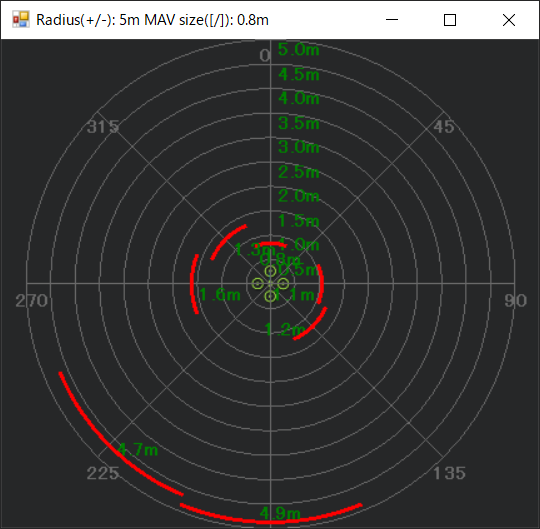

# 室内用ドローン開発

## フライトコントローラ環境構築

### ① ファームウェア インストール

* Copter 用にファームウェアを更新します。

### ② ArduPilot 設定（ROS）

[ROS and VIO tracking camera for non-GPS Navigation](https://ardupilot.org/dev/docs/ros-vio-tracking-camera.html)<br>
[Cartographer SLAM for Non-GPS Navigation](https://ardupilot.org/dev/docs/ros-cartographer-slam.html) を参考。

* SERIAL2_PROTOCOL = 2 (MAVLink2). Note this assumes the RPI4 is connected to AutoPilot “Telem2” port.
* SERIAL2_BAUD = 921 (921600 baud)
* SERIAL2_OPTIONS = 0 (the default)
* BRD_SER2_RTSCTS = 2 (the default)
* BRD_RTC_TYPES = 2 (GPS -> UTC Time)
* VISO_TYPE = 1 (enable visual odometry)
* AHRS_EKF_TYPE = 3 (the default) to use EKF3
* EK2_ENABLE = 0 (the default)
* EK3_ENABLE = 1 (the default)
* EK3_SRC1_POSXY = 6 (ExternalNav)
* EK3_SRC1_VELXY = 6 (ExternalNav)
* EK3_SRC1_VELZ = 6 (ExternalNav)
* EK3_SRC1_YAW = 6 (ExternalNav)
* EK3_SRC1_POSZ = 1 (Baro which is safer because of the camera’s weakness to high vibrations)
* EK3_GPS_CHECK = 0 to bypass the EKF’s check of the GPS
* EK3_POSNE_M_NSE = 0.5
* EK3_VELD_M_NSE = 0.1
* EK3_VELNE_M_NSE = 0.1
* GPS_TYPE = 0 to disable the GPS
* COMPASS_ENABLE = 0, COMPASS_USE = 0, COMPASS_USE2 = 0, COMPASS_USE3 = 0 to disable the EKF’
* ARMING_CHECK = 388598 (optional, to disable GPS checks)
* LOG_DISARMED = 3 (Replay Logging)
* LOG_REPLAY =1 (Replay Logging)

### ③ 高度センサー 設定

高度センサーとしては、下向きに距離センサー（TFmini Lidar）を設置します。


ArduPilotの設定については、<br>
[Benewake TFmini / TFmini Plus lidar -- Copter documentation (ardupilot.org)](https://ardupilot.org/copter/docs/common-benewake-tfmini-lidar.html) 参考

* GPS2ポートに接続する場合は、シリアルパラメータは次のようになります。<br>
[Pixhawk FMUv2 / Cube FMU v3 Serial Mapping (ardupilot.org)](https://ardupilot.org/rover/docs/common-pixhawk-serial-names.html) 参考
* SERIAL4_PROTOCOL = 9（ライダー）
* SERIAL4_BAUD = 115（115200 ボー）
* RNGFND2_TYPE = 20（ベネウェイクシリアル）<br>
  ※TYPE設定後に Mission Planner を再起動して行う設定<br>
  　[Rover製作05 センサー・プロポの初期設定をする - Qiita](https://qiita.com/srs/items/eb50af277a29a129a5f9) 参考
  * RNGFND2_PIN = -1（未使用）
  * RNGFND2_FUNCTION = 0（Linear）
  * RNGFND2_OFFSET = 0（オフセット電圧）
  * RNGFND2_SCALING = 3（距離係数）
  * RNGFND2_MIN_CM = 10（計測最小距離(cm)）
  * RNGFND2_MAX_CM = 1000（計測最大距離(cm)）
  * RNGFND2_ORIENT = 25（取付方向：下）
  * RNGFND2_POS_X = 0（取付位置(X)）
  * RNGFND2_POS_Y = 0（取付位置(Y)）
  * RNGFND2_POS_Z = 0（取付位置(Z)）
  * RNGFND2_RMETRIC = 1（出力は供給電圧に依存する）

### ③ 衝突回避 設定

近接センサーとしては、360°距離センサー（YDLidar X4）を設置します。


ArduPilotの設定については、<br>
[Simple Object Avoidance — Copter documentation - ArduPilot](
https://ardupilot.org/copter/docs/common-simple-object-avoidance.html) 参考

* RNGFND1_TYPE = 10（MAVLink）<br>
  ※TYPE設定後に Mission Planner を再起動して行う設定
  * RNGFND1_PIN = -1（未使用）
  * RNGFND1_FUNCTION = 0（Linear）
  * RNGFND1_OFFSET = 0（オフセット電圧）
  * RNGFND1_SCALING = 3（距離係数）
  * RNGFND1_MIN_CM = 12（計測最小距離(cm)）
  * RNGFND1_MAX_CM = 1000（計測最大距離(cm)）
  * RNGFND1_ORIENT = 0（取付方向：前）
  * RNGFND1_POS_X = 0（取付位置(X)）
  * RNGFND1_POS_Y = 0（取付位置(Y)）
  * RNGFND1_POS_Z = 0（取付位置(Z)）
  * RNGFND1_RMETRIC = 1（出力は供給電圧に依存する）
* AVOID_ENABLE = 7 (“All”)<br>
  ※ENABLE設定後に Mission Planner を再起動して行う設定
  * AVOID_DIST_MAX = 2 (“meters”)
  * AVOID_BEHAVE = 0 (“Slide”)
* PRX1_TYPE = 2 (“MAVLink”)

## コンパニオンコンピューター 環境構築

### ① APSync環境構築

* [APSync T265 ubuntu20.04 環境構築](https://github.com/csc-takeda/droneschool/tree/main/APSync_ubuntu) を参考に環境構築します。

## ROS⇒DISTANCE_SENSOR 衝突回避 環境構築

DISTANCE_SENSORの設定については、<br>
[ROS distance sensor usage — Dev documentation - ArduPilot](https://ardupilot.org/dev/docs/ros-distance-sensors.html)  参考

### ① ydlidar_2d.launch の修正

```
$ cd ~/catkin_ws3/src/cartographer_ros/cartographer_ros/launch
$ cp -p ydlidar_2d.launch ydlidar_2d.launch.bak
$ vi ydlidar_2d.launch
　※記述内容は下記を参照して下さい。
```

* [ydlidar_2d.launch](./text/ydlidar_2d.launch.NG) を参照下さい。

```
$ diff ydlidar_2d.launch ydlidar_2d.launch.bak
61,63d60
<   <!-- topic relay -->
<   <node name="topic_relay" pkg="topic_tools" type="relay" args="/scan /mavros/distance_sensor/rangefinder_sub" />
< 
```

* ChatGPT を用いた調査内容は、[ChatGPT_QA01.md](./text/ChatGPT_QA01.md) を参照下さい。

### ② ROS 動作確認

ターミナル１で roscore を起動し、

```
$ roscore
```

ターミナル２で、slam を実行します。

```
$ roslaunch cartographer_ros ydlidar_2d.launch

[ERROR] [1684309123.704892390]: Client [/mavros] wants topic /mavros/distance_sensor/rangefinder_sub to have datatype/md5sum [sensor_msgs/Range/c005c34273dc426c67a020a87bc24148], but our version has [sensor_msgs/LaserScan/90c7ef2dc6895d81024acba2ac42f369]. Dropping connection.
```

ターミナル３で、mavros を実行します。

```
$ roslaunch mavros apm.launch fcu_protocol:=v2.0 fcu_url:=/dev/ttyAMA1:921600
```

別のターミナルで、物体検出結果を表示します。

```
$ rostopic list 
/constraint_list
/initialpose
/landmark_poses_list
/map
/mavros/distance_sensor/rangefinder_sub
/mavros/vision_pose/pose
/move_base_simple/goal
/point_cloud
/rosout
/rosout_agg
/scan
/scan_matched_points2
/submap_list
/tf
/tf_static
/trajectory_node_list

$ rostopic echo /mavros/distance_sensor/rangefinder_sub
header: 
  seq: 124
  stamp: 
    secs: 1684308168
    nsecs:  90868000
  frame_id: "laser_frame"
angle_min: -3.1415927410125732
angle_max: 3.1415927410125732
angle_increment: 0.012466637417674065
time_increment: 0.00019678725220728666
scan_time: 0.1267309933900833
range_min: 0.10000000149011612
range_max: 12.0
ranges: [0.0, 2.382999897003174, 2.384999990463257, 2.38700008392334, 2.382999897003174, 2.378999948501587, 2.4019999504089355, 2.4030001163482666, 2.4089999198913574, 2.4140000343322754, 2.430000066757202, 2.434999942779541, 2.438999891281128, 2.4549999237060547, 2.4670000076293945, 2.4670000076293945, 2.4639999866485596, 2.4630000591278076, 2.5, 2.506999969482422, 2.515000104904175, 2.322000026702881, 2.5490000247955322, 2.555000066757202, 2.5239999294281006, 2.427999973297119, 2.302000045776367, 2.0339999198913574, 2.0420000553131104, 2.0480000972747803, 2.0429999828338623, 0.0, 0.0, 2.443000078201294, 0.0, 0.0, 2.2100000381469727, 2.1989998817443848, 2.190000057220459, 2.24399995803833, 2.2899999618530273, 2.2890000343322754, 0.0, 0.0, 2.322000026702881, 2.3289999961853027, 0.0, 0.0, 3.114000082015991, 3.1429998874664307, 3.1640000343322754, 3.2269999980926514, 3.25600004196167, 3.296999931335449, 3.3580000400543213, 3.3929998874664307, 3.427999973297119, 3.4639999866485596, 3.5390000343322754, 3.5820000171661377, 3.624000072479248, 3.6589999198913574, 3.75600004196167, 3.803999900817871, 3.8510000705718994, 3.9709999561309814, 4.011000156402588, 4.070000171661377, 4.130000114440918, 4.243000030517578, 4.309999942779541, 4.380000114440918, 4.448999881744385, 4.6020002365112305, 4.671999931335449, 4.749000072479248, 4.827000141143799, 5.006999969482422, 5.111000061035156, 5.218999862670898, 5.327000141143799, 5.540999889373779, 5.677000045776367, 5.815999984741211, 6.077000141143799, 6.239999771118164, 6.38100004196167, 0.0, 0.0, 0.0, 0.0, 8.213000297546387, 7.958000183105469, 7.952000141143799, 0.0, 0.0, 0.0, 0.0, 0.0, 0.0, 0.0, 0.0, 0.0, 0.0, 0.0, 0.0, 0.0, 3.015000104904175, 3.003999948501587, 0.0, 0.0, 2.9040000438690186, 2.8980000019073486, 2.8949999809265137, 2.8929998874664307, 2.8910000324249268, 2.890000104904175, 2.8910000324249268, 2.890000104904175, 2.888000011444092, 2.8970000743865967, 2.8910000324249268, 2.8910000324249268, 2.8910000324249268, 2.9030001163482666, 0.0, 0.0, 7.633999824523926, 7.622000217437744, 7.771999835968018, 7.711999893188477, 7.651000022888184, 7.7829999923706055, 7.7870001792907715, 7.818999767303467, 7.8520002365112305, 7.985000133514404, 7.748000144958496, 7.894999980926514, 8.041999816894531, 7.795000076293945, 8.09000015258789, 8.093000411987305, 8.095999717712402, 0.0, 7.6579999923706055, 7.442999839782715, 6.982999801635742, 6.841000080108643, 6.633999824523926, 6.331999778747559, 6.158999919891357, 6.019999980926514, 5.879000186920166, 5.633999824523926, 5.485000133514404, 5.497000217437744, 0.0, 2.934999942779541, 2.7330000400543213, 0.0, 0.0, 0.0, 0.0, 0.0, 0.0, 0.0, 0.0, 5.658999919891357, 0.0, 0.0, 0.0, 0.0, 0.0, 0.0, 0.0, 0.0, 0.0, 0.0, 0.0, 0.0, 0.0, 0.0, 0.0, 0.0, 0.0, 3.990000009536743, 3.950000047683716, 0.0, 0.0, 0.0, 0.8450000286102295, 0.843999981880188, 0.8479999899864197, 0.8619999885559082, 0.8659999966621399, 0.871999979019165, 0.8880000114440918, 0.8889999985694885, 0.8899999856948853, 0.8880000114440918, 0.8849999904632568, 0.890999972820282, 0.8930000066757202, 0.8840000033378601, 0.8759999871253967, 0.8579999804496765, 0.847000002861023, 0.8420000076293945, 0.8349999785423279, 0.8339999914169312, 0.8330000042915344, 0.8289999961853027, 0.828000009059906, 0.828000009059906, 0.828000009059906, 0.8500000238418579, 0.8579999804496765, 0.8640000224113464, 0.8700000047683716, 0.0, 0.0, 0.0, 0.0, 0.0, 0.0, 3.5510001182556152, 3.572000026702881, 3.6010000705718994, 3.4800000190734863, 3.4820001125335693, 3.4690001010894775, 3.4670000076293945, 3.4560000896453857, 3.4489998817443848, 3.447999954223633, 3.447000026702881, 3.437999963760376, 3.4489998817443848, 3.440999984741211, 3.434000015258789, 3.440999984741211, 3.427999973297119, 3.434999942779541, 3.441999912261963, 3.447000026702881, 3.438999891281128, 3.443000078201294, 3.447000026702881, 3.4549999237060547, 3.4579999446868896, 3.4570000171661377, 3.5179998874664307, 3.3589999675750732, 0.0, 0.0, 0.0, 0.0, 0.0, 0.0, 0.0, 0.0, 0.0, 0.0, 0.0, 0.0, 0.0, 0.0, 0.0, 0.0, 0.0, 0.0, 0.0, 0.0, 0.0, 0.0, 0.46799999475479126, 0.4650000035762787, 0.4659999907016754, 0.4690000116825104, 0.0, 0.0, 0.0, 0.0, 0.0, 0.0, 0.0, 0.0, 0.0, 0.0, 0.0, 0.0, 0.0, 0.0, 0.0, 0.0, 0.0, 0.0, 0.0, 0.0, 0.0, 0.0, 0.0, 0.0, 0.0, 0.0, 0.0, 0.0, 0.0, 0.0, 0.0, 0.0, 0.0, 0.0, 0.0, 0.0, 0.0, 0.0, 0.0, 0.0, 0.0, 0.0, 0.0, 0.0, 0.0, 0.0, 0.0, 0.0, 0.0, 0.0, 0.0, 0.0, 0.0, 0.0, 0.0, 0.0, 0.0, 0.0, 0.0, 0.0, 0.0, 0.0, 0.0, 0.0, 0.0, 0.0, 0.0, 0.0, 0.0, 0.0, 0.0, 0.0, 0.0, 0.0, 0.0, 0.0, 0.0, 0.0, 0.0, 0.0, 0.0, 0.0, 0.0, 0.0, 0.0, 0.0, 0.0, 0.0, 0.0, 0.0, 0.0, 0.0, 0.0, 0.0, 0.0, 0.0, 0.0, 0.0, 0.0, 0.0, 0.0, 0.0, 0.0, 0.0, 0.0, 0.0, 0.0, 0.0, 0.0, 0.0, 0.0, 0.0, 3.1649999618530273, 0.0, 0.0, 0.0, 0.0, 2.5230000019073486, 0.0, 0.0, 2.5490000247955322, 2.569000005722046, 0.0, 0.0, 0.0, 0.0, 0.0, 0.0, 0.0, 0.0, 0.0, 2.559000015258789, 2.566999912261963, 2.5820000171661377, 0.0, 3.6589999198913574, 3.684999942779541, 3.7079999446868896, 3.7360000610351562, 3.7890000343322754, 3.818000078201294, 3.8480000495910645, 0.0, 9.435999870300293, 9.395999908447266, 9.503999710083008, 9.607000350952148, 9.894000053405762, 9.600000381469727, 9.503000259399414, 9.489999771118164, 9.793000221252441, 9.859999656677246, 9.942999839782715, 10.579999923706055, 10.9399995803833, 0.0, 7.525000095367432, 0.0, 0.0, 7.8460001945495605, 0.0, 0.0, 0.0, 10.732999801635742, 0.0, 0.0, 0.0, 0.0, 4.5879998207092285, 0.0, 3.7679998874664307, 3.7730000019073486, 3.7950000762939453, 3.8519999980926514, 0.0, 3.8350000381469727, 3.8580000400543213, 3.9779999256134033, 4.085999965667725, 4.315000057220459, 4.2129998207092285, 4.01800012588501, 4.019999980926514, 4.040999889373779, 0.0, 0.0, 5.432000160217285, 5.581999778747559, 6.255000114440918, 6.579999923706055, 0.0, 0.0, 0.0, 5.284999847412109, 5.1620001792907715, 0.0, 0.0, 0.0, 0.0, 8.470999717712402, 0.0, 0.0, 8.430000305175781, 8.404000282287598, 8.38599967956543, 8.368000030517578, 8.348999977111816, 8.354999542236328, 8.343999862670898, 8.329999923706055, 8.310999870300293, 8.303000450134277, 8.310999870300293, 8.361000061035156, 0.0, 0.0, 2.367000102996826, 2.371000051498413, 2.368000030517578, 2.371000051498413, 2.374000072479248, 2.375999927520752, 2.378000020980835, 2.38100004196167]
intensities: [0.0, 1008.0, 1008.0, 1008.0, 1008.0, 1008.0, 1008.0, 1008.0, 1008.0, 1008.0, 1008.0, 1008.0, 1008.0, 1008.0, 1008.0, 1008.0, 1008.0, 1008.0, 1008.0, 1008.0, 1008.0, 1008.0, 1008.0, 1008.0, 1008.0, 1008.0, 1008.0, 1008.0, 1008.0, 1008.0, 1008.0, 0.0, 0.0, 1008.0, 0.0, 0.0, 1008.0, 1008.0, 1008.0, 1008.0, 1008.0, 1008.0, 0.0, 0.0, 1008.0, 1008.0, 0.0, 0.0, 1008.0, 1008.0, 1008.0, 1008.0, 1008.0, 1008.0, 1008.0, 1008.0, 1008.0, 1008.0, 1008.0, 1008.0, 1008.0, 1008.0, 1008.0, 1008.0, 1008.0, 1008.0, 1008.0, 1008.0, 1008.0, 1008.0, 1008.0, 1008.0, 1008.0, 1008.0, 1008.0, 1008.0, 1008.0, 1008.0, 1008.0, 1008.0, 1008.0, 1008.0, 1008.0, 1008.0, 1008.0, 1008.0, 1008.0, 0.0, 0.0, 0.0, 0.0, 1008.0, 1008.0, 1008.0, 0.0, 0.0, 0.0, 0.0, 0.0, 0.0, 0.0, 0.0, 0.0, 0.0, 0.0, 0.0, 0.0, 1008.0, 1008.0, 0.0, 0.0, 1008.0, 1008.0, 1008.0, 1008.0, 1008.0, 1008.0, 1008.0, 1008.0, 1008.0, 1008.0, 1008.0, 1008.0, 1008.0, 1008.0, 0.0, 0.0, 1008.0, 1008.0, 1008.0, 1008.0, 1008.0, 1008.0, 1008.0, 1008.0, 1008.0, 1008.0, 1008.0, 1008.0, 1008.0, 1008.0, 1008.0, 1008.0, 1008.0, 0.0, 1008.0, 1008.0, 1008.0, 1008.0, 1008.0, 1008.0, 1008.0, 1008.0, 1008.0, 1008.0, 1008.0, 1008.0, 0.0, 1008.0, 1008.0, 0.0, 0.0, 0.0, 0.0, 0.0, 0.0, 0.0, 0.0, 1008.0, 0.0, 0.0, 0.0, 0.0, 0.0, 0.0, 0.0, 0.0, 0.0, 0.0, 0.0, 0.0, 0.0, 0.0, 0.0, 0.0, 0.0, 1008.0, 1008.0, 0.0, 0.0, 0.0, 1008.0, 1008.0, 1008.0, 1008.0, 1008.0, 1008.0, 1008.0, 1008.0, 1008.0, 1008.0, 1008.0, 1008.0, 1008.0, 1008.0, 1008.0, 1008.0, 1008.0, 1008.0, 1008.0, 1008.0, 1008.0, 1008.0, 1008.0, 1008.0, 1008.0, 1008.0, 1008.0, 1008.0, 1008.0, 0.0, 0.0, 0.0, 0.0, 0.0, 0.0, 1008.0, 1008.0, 1008.0, 1008.0, 1008.0, 1008.0, 1008.0, 1008.0, 1008.0, 1008.0, 1008.0, 1008.0, 1008.0, 1008.0, 1008.0, 1008.0, 1008.0, 1008.0, 1008.0, 1008.0, 1008.0, 1008.0, 1008.0, 1008.0, 1008.0, 1008.0, 1008.0, 1008.0, 0.0, 0.0, 0.0, 0.0, 0.0, 0.0, 0.0, 0.0, 0.0, 0.0, 0.0, 0.0, 0.0, 0.0, 0.0, 0.0, 0.0, 0.0, 0.0, 0.0, 0.0, 0.0, 1008.0, 1008.0, 1008.0, 1008.0, 0.0, 0.0, 0.0, 0.0, 0.0, 0.0, 0.0, 0.0, 0.0, 0.0, 0.0, 0.0, 0.0, 0.0, 0.0, 0.0, 0.0, 0.0, 0.0, 0.0, 0.0, 0.0, 0.0, 0.0, 0.0, 0.0, 0.0, 0.0, 0.0, 0.0, 0.0, 0.0, 0.0, 0.0, 0.0, 0.0, 0.0, 0.0, 0.0, 0.0, 0.0, 0.0, 0.0, 0.0, 0.0, 0.0, 0.0, 0.0, 0.0, 0.0, 0.0, 0.0, 0.0, 0.0, 0.0, 0.0, 0.0, 0.0, 0.0, 0.0, 0.0, 0.0, 0.0, 0.0, 0.0, 0.0, 0.0, 0.0, 0.0, 0.0, 0.0, 0.0, 0.0, 0.0, 0.0, 0.0, 0.0, 0.0, 0.0, 0.0, 0.0, 0.0, 0.0, 0.0, 0.0, 0.0, 0.0, 0.0, 0.0, 0.0, 0.0, 0.0, 0.0, 0.0, 0.0, 0.0, 0.0, 0.0, 0.0, 0.0, 0.0, 0.0, 0.0, 0.0, 0.0, 0.0, 0.0, 0.0, 0.0, 0.0, 0.0, 0.0, 1008.0, 0.0, 0.0, 0.0, 0.0, 1008.0, 0.0, 0.0, 1008.0, 1008.0, 0.0, 0.0, 0.0, 0.0, 0.0, 0.0, 0.0, 0.0, 0.0, 1008.0, 1008.0, 1008.0, 0.0, 1008.0, 1008.0, 1008.0, 1008.0, 1008.0, 1008.0, 1008.0, 0.0, 1008.0, 1008.0, 1008.0, 1008.0, 1008.0, 1008.0, 1008.0, 1008.0, 1008.0, 1008.0, 1008.0, 1008.0, 1008.0, 0.0, 1008.0, 0.0, 0.0, 1008.0, 0.0, 0.0, 0.0, 1008.0, 0.0, 0.0, 0.0, 0.0, 1008.0, 0.0, 1008.0, 1008.0, 1008.0, 1008.0, 0.0, 1008.0, 1008.0, 1008.0, 1008.0, 1008.0, 1008.0, 1008.0, 1008.0, 1008.0, 0.0, 0.0, 1008.0, 1008.0, 1008.0, 1008.0, 0.0, 0.0, 0.0, 1008.0, 1008.0, 0.0, 0.0, 0.0, 0.0, 1008.0, 0.0, 0.0, 1008.0, 1008.0, 1008.0, 1008.0, 1008.0, 1008.0, 1008.0, 1008.0, 1008.0, 1008.0, 1008.0, 1008.0, 0.0, 0.0, 1008.0, 1008.0, 1008.0, 1008.0, 1008.0, 1008.0, 1008.0, 1008.0]
---
　　　　：
```
### ③ ydlidar_2d.launch エラー対策

* ydlidar_2d.launch の修正

```
$ cd ~/catkin_ws3/src/cartographer_ros/cartographer_ros/launch
$ cp -p ydlidar_2d.launch ydlidar_2d.launch.old
$ vi ydlidar_2d.launch
　※記述内容は下記を参照して下さい。
```

* [ydlidar_2d.launch](./text/ydlidar_2d.launch.old1) を参照下さい。

```
$ diff ydlidar_2d.launch ydlidar_2d.launch.old
61,67d60
<   <node
<     name="laser_scan_to_range_converter"
<     pkg="cartographer_ros"
<     type="laser_scan_to_range_converter.py"
<     output="screen">
<   </node>
<
69c62
<   <node name="topic_relay" pkg="topic_tools" type="relay" args="/converted_range /mavros/distance_sensor/rangefinder_sub" />
---
>   <node name="topic_relay" pkg="topic_tools" type="relay" args="/scan /mavros/distance_sensor/rangefinder_sub" />
```

* laser_scan_to_range_converter.py の作成

```
$ cd ~/catkin_ws3/src/cartographer_ros/cartographer_ros/scripts
$ vi laser_scan_to_range_converter.py
　※記述内容は下記を参照して下さい。
$ chmod +x laser_scan_to_range_converter.py
```

* [laser_scan_to_range_converter.py](./text/laser_scan_to_range_converter.py) を参照下さい。<br>
※Windowsで記載した場合は、必ずUnix改行コードに変更して下さい。

* ChatGPT を用いた調査内容は、[ChatGPT_QA02.md](./text/ChatGPT_QA02.md) , [ChatGPT_QA03.md](./text/ChatGPT_QA03.md) を参照下さい。

### ④ ROS 動作確認

ターミナル１で roscore を起動し、

```
$ roscore
```

ターミナル２で、slam を実行します。

```
$ roslaunch cartographer_ros ydlidar_2d.launch
```

ターミナル３で、mavros を実行します。

```
$ roslaunch mavros apm.launch fcu_protocol:=v2.0 fcu_url:=/dev/ttyAMA1:921600
　　　　：
[ERROR] [xxxx]: FCU: PreArm: Rangefinder 1: No Data
[ERROR] [xxxx]: FCU: PreArm: PRX1: No Data
　　　　：
```

別のターミナルで、物体検出結果を表示します。

```
header:
  seq: 30598162
  stamp:
    secs: 1684742881
    nsecs: 772494000
  frame_id: "laser_frame"
radiation_type: 1
field_of_view: 1.8076623678207397
min_range: 0.10000000149011612
max_range: 12.0
range: 3.11899995803833
---
header:
  seq: 30598163
  stamp:
    secs: 1684742881
    nsecs: 772494000
  frame_id: "laser_frame"
radiation_type: 1
field_of_view: 1.8201289176940918
min_range: 0.10000000149011612
max_range: 12.0
range: 3.125
---
　　　　：
```

### ⑤ ArduPilot 動作確認

#### (1) Mission Planner を起動

#### (2) ROS を起動

#### (3) Mission Planner から以下を確認

* 自己位置情報の受信確認
  1. Mission Planner で Ctrl+F を押します。
  1. “Mavlink Inspector” をクリックします。
  1. VISION_POSITION_DELTA の値を確認します。
  1. DISTANCE_SENSOR の値を確認します。

  
  
  * **動作問題なし。**

* 距離情報の受信確認
  1. Mission Planner で “FLIGHT DATA” を選択します。
  1. “Status” を選択します。
  1. “sonarrange” の値を確認します。

  * **値が"0.13"になっている。⇒　高度センサーを表示、360°Lidarの情報なし。**

* リアルタイムの距離確認
  1. Mission Planner で Ctrl+F を押します。
  1. “Proximity” をクリックします。
  1. proximity viewer を確認します。

  

  * **高度センサーを表示、360°Lidarの情報なし。⇒　OBSTACLE_DISTANCE を検討。**

## ROS⇒OBSTACLE_DISTANCE 衝突回避 環境構築

OBSTACLE_DISTANCEについては、<br>
[AP_Proximity: add support for OBSTACLE_DISTANCE mavlink message](https://github.com/ArduPilot/ardupilot/issues/9269)<br>
[AP_Proximity: Add support for OBSTACLE_DISTANCE mavlink message](https://github.com/ArduPilot/ardupilot/pull/9418)<br>
[AP_Proximity: Add support for OBSTACLE_DISTANCE mavlink message (Attempt 2)](https://github.com/ArduPilot/ardupilot/pull/9490)<br>
[mapping LaserScan to obstacle_distance mavlink message](https://github.com/mavlink/mavros/issues/1082)<br>
[OBSTACLE_DISTANCE ( #330 )](https://mavlink.io/en/messages/common.html#OBSTACLE_DISTANCE) を参考。

### ① ydlidar_2d.launch の修正

```
$ cd ~/catkin_ws3/src/cartographer_ros/cartographer_ros/launch
$ cp -p ydlidar_2d.launch ydlidar_2d.launch.old2
$ vi ydlidar_2d.launch
　※記述内容は下記を参照して下さい。
```

* [ydlidar_2d.launch](./text/ydlidar_2d.launch) を参照下さい。

```
$ diff ydlidar_2d.launch ydlidar_2d.launch.old2
60a61,67
>   <node
>     name="laser_scan_to_range_converter"
>     pkg="cartographer_ros"
>     type="laser_scan_to_range_converter.py"
>     output="screen">
>   </node>
>
62c69
<   <node name="topic_relay" pkg="topic_tools" type="relay" args="/scan /mavros/obstacle/send" />
---
>   <node name="topic_relay" pkg="topic_tools" type="relay" args="/converted_range /mavros/distance_sensor/rangefinder_sub" />
```

### ② 高度センサー 設定

高度センサーとしては、下向きに距離センサー（TFmini Lidar）を設置します。


ArduPilotの設定については、<br>
[Benewake TFmini / TFmini Plus lidar -- Copter documentation (ardupilot.org)](https://ardupilot.org/copter/docs/common-benewake-tfmini-lidar.html) 参考

* GPS2ポートに接続する場合は、シリアルパラメータは次のようになります。<br>
[Pixhawk FMUv2 / Cube FMU v3 Serial Mapping (ardupilot.org)](https://ardupilot.org/rover/docs/common-pixhawk-serial-names.html) 参考
* SERIAL4_PROTOCOL = 9（ライダー）
* SERIAL4_BAUD = 115（115200 ボー）
* RNGFND1_TYPE = 0（disable）<br>
* RNGFND2_TYPE = 20（ベネウェイクシリアル）<br>
  ※TYPE設定後に Mission Planner を再起動して行う設定<br>
  　[Rover製作05 センサー・プロポの初期設定をする - Qiita](https://qiita.com/srs/items/eb50af277a29a129a5f9) 参考
  * RNGFND2_PIN = -1（未使用）
  * RNGFND2_FUNCTION = 0（Linear）
  * RNGFND2_OFFSET = 0（オフセット電圧）
  * RNGFND2_SCALING = 3（距離係数）
  * RNGFND2_MIN_CM = 10（計測最小距離(cm)）
  * RNGFND2_MAX_CM = 1000（計測最大距離(cm)）
  * RNGFND2_ORIENT = 25（取付方向：下）
  * RNGFND2_POS_X = 0（取付位置(X)）
  * RNGFND2_POS_Y = 0（取付位置(Y)）
  * RNGFND2_POS_Z = 0（取付位置(Z)）
  * RNGFND2_RMETRIC = 1（出力は供給電圧に依存する）

### ③ 衝突回避 設定

近接センサーとしては、360°距離センサー（YDLidar X4）を設置します。


ArduPilotの設定については、<br>
[Simple Object Avoidance — Copter documentation - ArduPilot](
https://ardupilot.org/copter/docs/common-simple-object-avoidance.html) 参考

* AVOID_ENABLE = 7 (“All”)<br>
  ※ENABLE設定後に Mission Planner を再起動して行う設定
  * AVOID_DIST_MAX = 2 (“meters”)
  * AVOID_BEHAVE = 1 (“Stop”)
* PRX1_TYPE = 2 (“MAVLink”)

### ④ ArduPilot 動作確認

#### (1) Mission Planner を起動

#### (2) ROS を起動

#### (3) Mission Planner から以下を確認

* 自己位置情報の受信確認
  1. Mission Planner で Ctrl+F を押します。
  1. “Mavlink Inspector” をクリックします。
  1. VISION_POSITION_DELTA の値を確認します。
  1. OBSTACLE_DISTANCE の値を確認します。

  
  
  * **動作問題なし。**

* 距離情報の受信確認
  1. Mission Planner で “FLIGHT DATA” を選択します。
  1. “Status” を選択します。
  1. “sonarrange” の値を確認します。

  * **値が"0.13"になっている。⇒　高度センサーを表示。**

* リアルタイムの距離確認
  1. Mission Planner で Ctrl+F を押します。
  1. “Proximity” をクリックします。
  1. proximity viewer を確認します。

  

  * **360°Lidarの情報を表示。**

## リモート接続 環境構築

### ① Xrdpリモートデスクトップサーバの構築

[Ubuntu20.04にXrdpをインストールする方法](https://ja.linux-console.net/?p=671#gsc.tab=0) を参考に環境を構築します。

```
$ sudo apt install -y xrdp
$ sudo adduser xrdp ssl-cert
$ sudo systemctl enable xrdp
$ sudo systemctl start xrdp
$ sudo reboot
```

* **<font color="red">起動しないことも多く、起動しても rviz の様な画像を表示するソフトは画像が崩れる。</font>**　<br>

### ② VNC（Virtual Network Computing）サーバの構築

* [Ubuntu 20.04にTigerVNCをインストールする](https://serverarekore.blogspot.com/2020/05/ubuntu-2004tigervnc.html)<br>
  [ubuntu 20.04 VNC Server のインストール](https://qiita.com/hoshianaaa/items/52a52a0457db08b6cf91) を参考。

#### (1) TightVNC サーバをインストール

```
$ sudo apt install tigervnc-common tigervnc-standalone-server tigervnc-xorg-extension -y
```

#### (2) パスワードの生成

```
$ tigervncpasswd
Password:
Verify:
Would you like to enter a view-only password (y/n)? n
```

#### (3) 設定ファイル作成

* [lxde - Connecting to Lubuntu desktop via VNC - Unix & Linux Stack Exchange](https://unix.stackexchange.com/questions/676579/connecting-to-lubuntu-desktop-via-vnc) を参考に、<br>
  [xstartup](./text/xstartup) という名前のファイルを ~/.vnc 内に作成する。

```
$ vi ~/.vnc/xstartup
```
```
#!/bin/bash
unset SESSION_MANAGER
unset DBUS_SESSION_BUS_ADDRESS
exec startlxqt
```

実行権限付与

```
$ sudo chmod +x ~/.vnc/xstartup
```

#### (4) serviceファイル作成

* [vncserver@.service](./text/vncserver@.service) というファイルを /etc/systemd/system/ 内に作成する。<br>
  （参考HP記載のサンプルの hoshina の部分を自分のユーザー名に変更する）

```
$ sudo vi /etc/systemd/system/vncserver@.service
```
```
[Unit]
Description=Start TightVNC server at startup
After=syslog.target network.target

[Service]
Type=forking
User=pi
Group=pi
WorkingDirectory=/home/pi

PIDFile=/home/pi/.vnc/%H:%i.pid
ExecStartPre=-/usr/bin/vncserver -kill :%i > /dev/null 2>&1
ExecStart=/usr/bin/vncserver -depth 24 -geometry 1280x800 -localhost :%i
ExecStop=/usr/bin/vncserver -kill :%i

[Install]
WantedBy=multi-user.target
```

#### (5) serviceの起動

```
$ sudo systemctl daemon-reload
$ sudo systemctl enable vncserver@1.service
Created symlink /etc/systemd/system/multi-user.target.wants/vncserver@1.service → /etc/systemd/system/vncserver@.service.
$ sudo systemctl start vncserver@1.service
```

#### (6) 起動確認

```
$ sudo reboot
$ vncserver -list
```

以下のように出力されればOK<br>(※PROCESS IDのあとに、英語でなんか書かれていたらvnc serverの起動失敗している)

```
TigerVNC server sessions:

X DISPLAY #     RFB PORT #      PROCESS ID
:1              5901            932
```

#### (7) VNCクライアントをインストール

* TightVNC Viewer
  * [WindowsにTightVNC Viewerをインストールする](https://postgresweb.com/install-tightvnc-viewer-on-windows) を参考にインストールします。

#### (8) VNCクライアント接続

* TightVNC Viewer を起動したら、接続先を入力しConnectをクリックします。
* 接続先は、「接続先IPアドレス：Server DISPLAY番号」になります。

  
  
  
